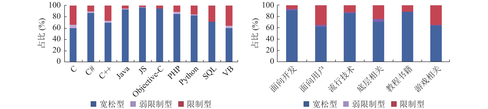
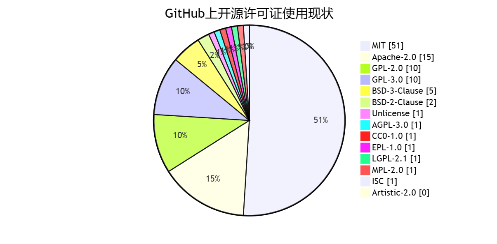
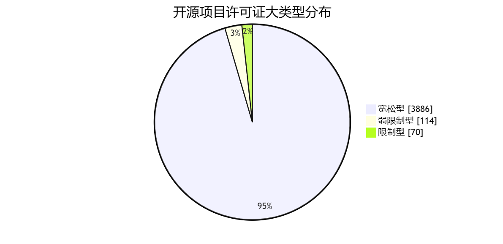
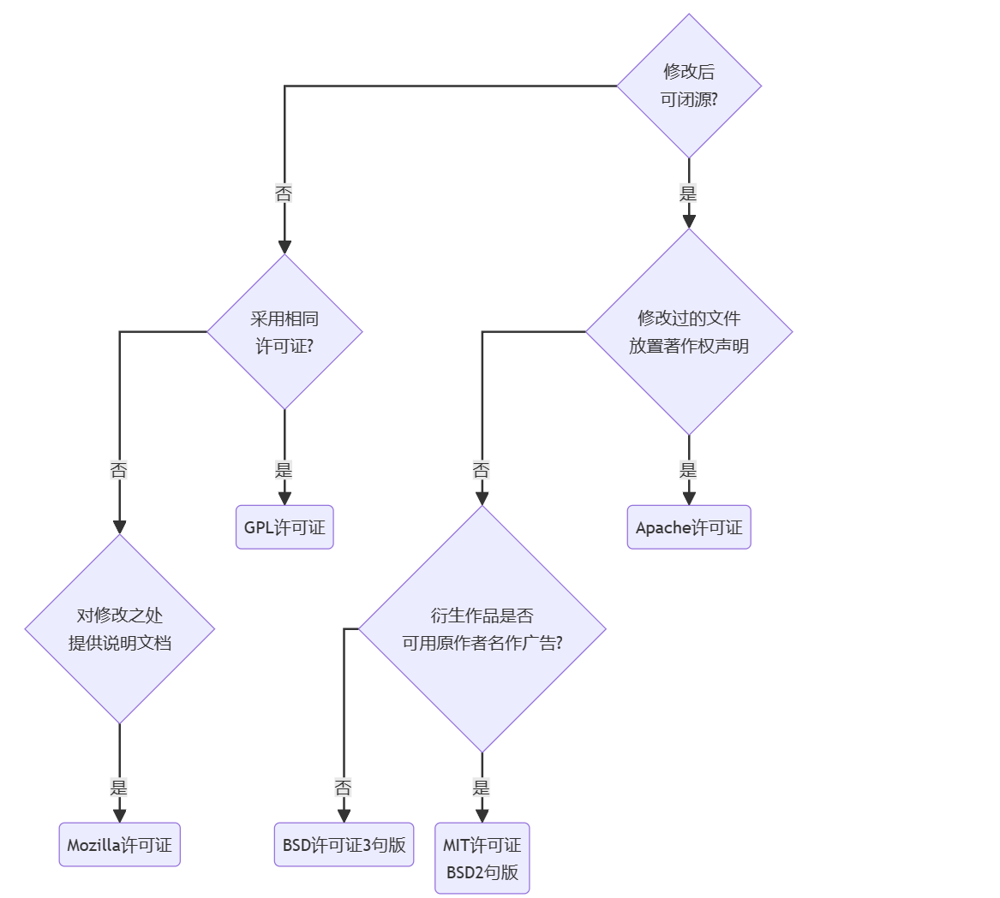
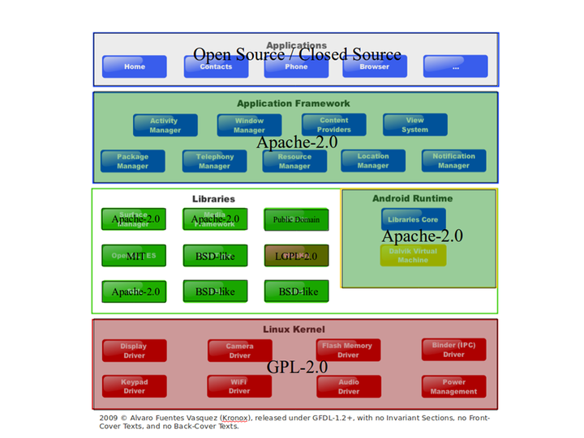
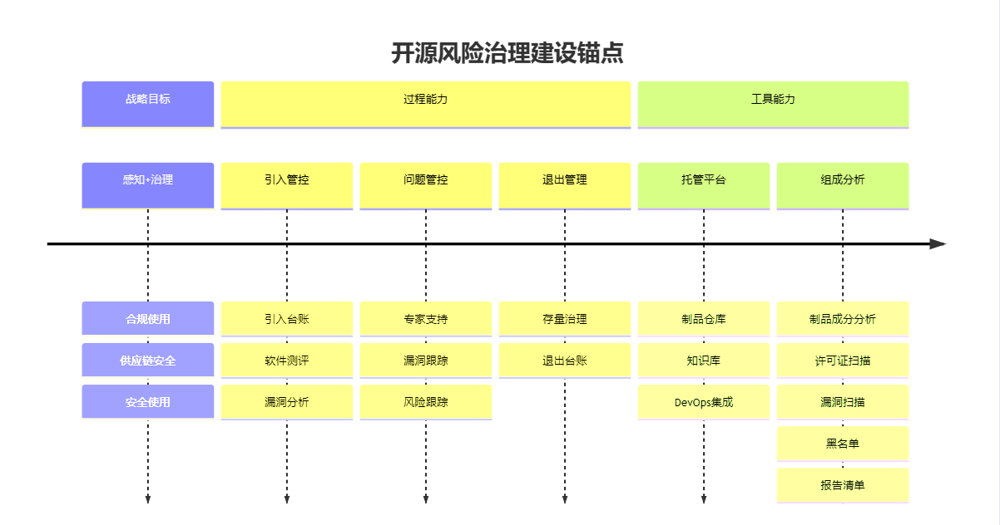

2023年开源软件的下载使用达到了**4万亿次**，以空前的力量推动软件生态的发展与创新。这里面下载最突出的领域语言是JavaScript，能占到1.5万亿

# 开宗明义

> 许可证大分类，强度由高到低

| **宽松式（permissive）许可证**                    | Copyleft（许可复制权，著作权保留） 许可证                    |
| ------------------------------------------------- | ------------------------------------------------------------ |
| BSD (Berkeley Software Distribution) MIT Apache 2 | Affero GPL (AGPL) GPL Lesser GPL (LGPL) Mozilla Public License (MPL) Eclipse Public License (EPL) Common Development and Distribution License (CDDL) |

- Copyright: 复制权，印刷术发明催生的印刷出版之权。用户只有使用权，没有其它如复制，重新修改发布的权利。
- Copyleft：著作权。版权归原作者所有，其它权利可自由决定与别人分享自己的作品。1984年发表《GNU宣言》，抨击封闭源码行为，也创造了该词。

> - Copyleft特性：意味着如果你修改软件并重新发布，必须将修改后的代码以原许可证方式发布，保证了代码的开放性和开源性。
> - CopyLeft下分强著作权和弱著作权
>   - 前者包括AGPL，SSPL，GPL许可证等，要求对软件的修改和扩展，必须按照该软件许可证进行开源，且不得违背原作品的限制条款。
>   - 后者包括LGPL，MPL许可证等，要求对软件的修改，重新分发必须按获得该软件的许可证进行开源，但合并这些软件代码的大型产品可以称为私有作品。

## 不指定任何开源许可证

- 没有明确注明所适用的开源许可证，则应用项目作者司法管辖区的“默认”版权。
- 没有明确的许可证，你，项目的作者，事实上并未放弃法律授予的任何权利。（即：一般作品中没声明协议的默认为copyright的，也就是版权保留）

## 代表性开源协议的价值主张

| 价值主张                            | 协议   | 权利义务                                                     |
| ----------------------------------- | ------ | ------------------------------------------------------------ |
| 我只想安心的写代码,其他随别人怎么搞 | MIT    | 署名作者，其它随意 允许他人修改源代码后再闭源，不用对修改过的文件做说明，且二次开发的软件可以使用原作者的名字做营销 |
| 我保留专利，但你们可以随便用        | Apache | 授权使用者免费使用个人专利，额外的简易专利授权，这点是与MIT的区别点 使用者必须放置协议说明 使用者需对修改部分声明 禁止用作者的名号进行商业广告 |
| 我希望代码生根发芽遍地开花          | GPL    | 使用者需遵循相同的协议进行开源 GPL/LGPL都保障原作者的知识产权，避免有人利用开源代码复制并开发类似的产品 |

和MIT有些类似的BSD同样是鼓励代码重用，但需尊重代码作者的著作权

## 软件供应链脱钩断链风险

伴随国际形势变迁，越来越多组织声明将遵循美国出口管制法律的约束，且蔓延到了开源领域，当时两大引爆事件：

- 全球最大开源软件基金会ASF（Apache 软件基金会）的管理办法中明确说明其遵循美国出口法律，所以它旗下所有项目亦受到美国出口法律的管制。而ASF旗下开源项目名单中有很多耳熟能详的项目：如Kafka，Solr，Hadoop，Spark等
- 全球最大源码托管平台GitHub表示：[GitHub.com](http://github.com/)，GitHub Enterprise Server及你上传到任一产品的信息可能受美国出口管制法律的约束，包括美国出口管理条例（EAR），且实际已对古巴与朝鲜等地实施限制

消息一出，国内外开源界议论纷纷，关于开源生态如何自立，做到在无法与国际接轨的情况下能健康发展的措施也被提上议程。

华为在加快国产开源操作系统鸿蒙的开发，看到国内第一个开源软件基金会从紧急筹备到建立，也看到第一个国产开源协议木兰的诞生。

# 正本清源

## 自由软件中分离出了开源概念

- 自由软件(Free Software)：此处的free强调的是自由，而不是价格上的免费。支持自由软件开发的非盈利组织为FSF(Free Software Foundation)。自由软件是指授权用户自由共享，学习和修改权利的软件，名称在上世纪80年代创造。你可以对此类软件做任何事情，甚至改进从中获利。
- 免费软件(Freeware): 与开源和自由软件不同，免费软件给最终用户提供了最小自由度。虽可被免费使用，但源码可能并不对外公开。

自由软件是一个比开源软件更严格的概念，因此所有自由软件都是开放源代码的，但不是所有的开源软件都能被称为“自由”。

> MIT，GPLv2，Apache v2，BSD都算是自由软件的许可证类型。

“开放源代码软件运动”是一个主要由程序工程师及其它电脑用户参与的声势浩大的运动。它是自由软件运动的一个分支，但两者差别并不明显。一般而言，自由软件运动是基于政治及哲学思想（有时被称为所谓黑客文化）的理想主义运动，而开放源代码运动则主要注重程序本身的质量提升。为了避免这些对于「自由」的探讨，而只专注于技术，在自己的领域做得更好，有人把「开源」这个概念分离了出来。

## 许可证

软件协议可分为开源和商业

- 商业协议，或者叫法律声明，许可协议，每个软件会有自己的一套行文，由软件作者或专门律师撰写，因涉及到以后侵权打官司这种事情，行文史非常严谨而讲究的，读起来很晦涩难懂
- 开源协议。开源并不等于免费，不等于没有约束。虽相对商业协议更加简明，但对于很多人来说还是像在看天书一样

大部分人都希望作品能被多数人分享查阅，这样不仅提高自己业界知名度，同时也方便了有需要的人。但代码一旦被贴出来，任何人都可看到并获取，之后发生的事情就无法控制了。所以为了公开分享你的代码，同时又让你对代码保留一定权利，在作品中声明一个许可协议是非常有必要的。

## 开源 != 免费

开源，是指公开源代码，但也并不代表就是免费。有时，开源也可以作为一种商业模式存在。

- 提供订阅服务 | 捐赠打赏
- 高级功能付费
- 提供云服务
- 生态价值
- 获得声誉谁说不是一种商业模式呢

## 开源的非经济利益

## 开源流派的理念比喻

开源组织是共产主义社会，商业公司联盟则是资本主义世界。

共产主义靠共产国际的会议决议来协作行动，商业公司则凭无数的商务协议组成利益共同体。理论上共产主义更先进，现实中总是输给一盘散沙，各怀鬼胎的资本主义世界。

Apache & GPL是两种加入共产主义社会的方式

- GPL是宣布自己国家也共产了，拒绝一切资本主义的东东
- Apache则是自己来参加共产国际大会，分享经验，但是走独立自主的道路
- 共产主义天然是国际主义的，终极目标是要看到环球遍是赤旗，而不是希望成员国直接为其贡献GDP
- 选择成为Apache体系的国家，的确消耗一部分优秀党员为其效力，又无法直接计入共产国际的GDP中，因为他们也要为自己国家生存发展考虑，不可能断绝与资本主义的一切来往，但终究是让共产主义理念得以发扬光大了。

# 开源许可证的市场

## 从编程语言看

从编程语言开源许可证分布进行统计

- C/C++ 主要使用MIT，BSD，Apache许可证，GPL/LGPL约占16%，整体使用更严格
- Java主要使用Apache，MIT许可证，GPL/LGPL约占1%，整体使用更宽

[]

## 市占率

# 许可证简洁区别示意

> 对于网络上的图，对LGPL的表达缩略的并不恰当，故不放置在此flowchart图中了。对LGPL感兴趣的可去查阅[[5\]](https://blog.diffday.com/开源许可证.html#fn:5)
>
> 静态链接至LGPL的代码/库，还是有一些衍生品行为要求的

| 许可证种类     | 要在源码里包含原许可证 | 允许商业使用                                     | 允许修改再发布 | 修改后的源码强制继续开源                                     |
| :------------- | ---------------------- | ------------------------------------------------ | -------------- | ------------------------------------------------------------ |
| BSD            | 是                     | 是（不能用原作者相关信息进行宣传）               | 是             | 否                                                           |
| MIT            | 是                     | 是                                               | 是             | 否                                                           |
| Apache         | 是                     | 是（禁止使用其商标与作者的相关信息进行商业行为） | 是             | 否                                                           |
| GPL            | 是                     | 是（商用代码要公开）                             | 是             | 只要源码中使用GPL的代码，都要开源                            |
| LGPL           | 是                     | 是                                               | 是             | 若用户只是对LGPL的程序库进行调用而不是包含其源码时，无需开源；反之需要 |
| Mozilla（MPL） | 是                     | 是                                               | 是             | 含有MPL许可证的代码放在单独文件里，只需开源这个文件。其它新增的文件无需开源 |

- MPL：允许重发布，免费修改，但要求修改后的代码版权归软件的发起者。这种授权维护了商业软件的利益，它要求基于这种软件的修改无偿贡献版权给该软件。这样，围绕该软件的所有代码版权都集中于开发发起人手中。但MPL允许修改及无偿使用，对链接也没有要求。
- EPL：CPL（Common Public License 1.0） 是 IBM 提出的开源协议，主要用于 IBM 或跟 IBM 相关的开源软件/项目中（例如，Eclipse、Open Laszlo 等）。已被 EPL 替代，EPL是一个与CPL相类似的许可证，任何扩展自 Eclipse 源码的代码也必须是开源的
- CDDL是MPL的扩展协议，它允许公共版权使用，无专利费，并提供专利保护，可集成于商业软件中，允许自行发布许可

# 详细区别和选择对照

> 许可证概念词汇释义

- 商用：用于商业用途，不论使用成果是否对外销售或盈利，只要使用主体为营利组织，因使用行为有助于主体经营，均视为”商用“
  - 公司及员工使用任何开源软件都属于商业使用，如将开源模型用于内部模型训练，不对外推广，但因为公司为盈利组织，此种情形仍属于商业行为
- 分发：通过任何媒介向他人提供程序、文档、数据等作品的行为。当今时代最为常见的就是手机App。
  - 传递副本：将作品拷贝提供给他人，可以是物理介质形式（如光盘或U盘）或以电子方式（如电子邮件，文件共享或网站下载）传递
  - 公开展示：在公共场所或网络上公开展示作品，使他人能获得访问、下载或复制的机会
  - 提供访问途径：在网络上提供作品的访问途径，使他人可通过远程访问、下载或复制作品
  - 包含在产品中：将作品捆绑在硬件或软件作品中，出售或分发给他人
- 公开来源：分发传播时，需提供该开源软件本身，修改版或包含该组件及其修改版的新软件的源代码（不同协议对于披露范围要求可能存在差异）
- 许可证声明：传播时必须包含授权许可证和版权声明的源文件副本，不需要编译成二进制文件
- 修改记录：必须有文档说明对代码的修改记录
- 商标使用：许可证表明表示不授权商标权，禁止使用开发者的名义或名称进行宣传，或许可证暗含表明不授权商标权
- 质量保证：开发者不对该开源软件质量提供任何保证或承诺
- 免责声明：阐述开发者不对用户使用该开源软件而带来的任何问题负责。

> 许可证权利、义务、限制、案例 对照表

| 类型                           | 权利(Permissions) | 条件-义务(Conditions) | 限制(Limitations) | 案例                                 |                |          |             |                   |               |               |          |             |          |                                          |                                  |
| ------------------------------ | ----------------- | --------------------- | ----------------- | ------------------------------------ | -------------- | -------- | ----------- | ----------------- | ------------- | ------------- | -------- | ----------- | -------- | ---------------------------------------- | -------------------------------- |
| 许可证归类                     | 许可证            | 商用(√)               | 传播分发(√)       | 修改(√)                              | 专利使用       | 自用 (√) | 公开源码(⊗) | 许可和版权声明(√) | 网络即分发(⊗) | 相同许可证(⊗) | 修改记录 | 免责声明(⊗) | 商标使用 | 质量保证(⊗)                              | 著名案例                         |
| CopyLeft                       | GPLv2.1           |                       |                   |                                      | 无声明，未提及 |          | √           |                   |               | √             | √        |             |          |                                          | Linux内核、MySQL、Git            |
| GPLv3                          |                   |                       |                   | √                                    |                | √        |             |                   | √             | √             |          |             |          | bash、gzip、wget                         |                                  |
| AGPL                           |                   |                       |                   | 无声明，未提及                       |                | √        |             | √                 | √             | √             |          |             |          | MongoDB(18.10前)、Tdengine（时序数据库） |                                  |
| LGPLv2.1                       |                   |                       |                   | 跟随对应GPL版本                      |                | 弱传染   |             |                   | √             |               |          |             |          | mariadb客户端动态库，glib，7-zip         |                                  |
| Mozilla 2.0-MPL                |                   |                       |                   | ⊗                                    |                | 弱传染   |             |                   | √             | √             |          |             |          | Firefox、LibreOffice                     |                                  |
| Permissive                     | MIT               |                       |                   |                                      | 无声明，未提及 |          |             |                   |               | ⊗             |          |             |          |                                          | Bootstrap、jQuery、Nodejs、Rails |
| Apache                         |                   |                       |                   | √                                    |                |          |             |                   | ⊗             | √             |          | ⊗           |          | Spring、Hadoop、Kylin、Kafka、netty      |                                  |
| BSD                            |                   |                       |                   | 2句版未提及  3句版⊗  4句原始版未提及 |                |          |             |                   | ⊗             |               |          | ⊗           |          | chromium、Nginx、FreeBSD、Redis、Django  |                                  |
| 商业                           | BSL 1.1           | 额外限制              |                   |                                      |                |          |             |                   |               |               |          |             | ⊗        |                                          | mariadb、CockroachDB、Akka       |
| FAIR SOURCE LICENSE            | 人数限制          |                       |                   |                                      |                |          |             |                   |               |               |          | ⊗           |          | GitLab、WIRED、FirstRead                 |                                  |
| Sun Software LICENSE Agreement | 商用须付费        | ⊗                     | ⊗                 | ⊗                                    |                | ⊗        | ⊗           | ⊗                 | ⊗             | ⊗             |          | ⊗           |          | com.sun.media:jai-codec                  |                                  |

# 典型开源许可证解读

## BSD多版本

BSD许可证有三种版本：初版的4句版许可证，“修订版”3句版许可证和“简化版”2句版许可证。4句版BSD许可证和3句版增加了对广告，名称重用的更多要求。如果你想保护自己的产品或品牌名称，可以考虑使用这两版许可证。

- 被许可方不得使用原作者名称或商标来为衍生作品背书（3句版和4句版BSD）
- 被许可方必须在提及此项目功能或用途的所有广告材料中致谢软件开发者和伯克利大学（4句版BSD，绑定伯克利大学，反倒不利于许可证走出伯克利，因此才被修订吧），让我们看看原文：All advertising materials mentioning features or use of this software must display the following acknowledgement: This product includes software developed by the University of California, Berkeley and its contributors.

这三种版本都在使用理念上高度接近MIT许可证。可以将2句版BSD许可证 =MIT许可证

### BSD vs MIT

与MIT类似，但版本太多，条款不够清晰简洁

不得使用版权所有者的姓名或其贡献者的姓名来推广

## Apache

Apache软件基金会起始于1999年，由一群在网上协作为网络服务器打源码补丁的人创建，源码最终被称为Apache Httpd项目。在2004年，开发了成熟的Apache 2.0许可证，成为世界上最受欢迎的开源许可证之一，授予用户使用，修改和分发等权限，且拥有非常明确的专利权，使得开发者能轻松使用和重用代码许可。

Apache软件基金会是一个公共慈善机构，服务于广大公众的最大利益，使命是为公众免费提供软件。使用邮件列表来作为讨论和决策的常规工具，因为其他人要一直往回翻阅去了解整个经过。

与MIT许可证下前端项目扎堆的情况不同，采用Apache许可证的项目涵盖的前后端，DevOps，大数据处理，深度学习等各种类型的系统，框架和工具。

虽然有各种类型的许可证，但不得不说MIT和Apache两个许可证加起来，就囊括很大一部分(66%)我们耳熟能详的项目了。

Apache与MIT的区别：

1. 是否要求明确声明修改了哪些部分
2. 是否明确限制商标使用权，Apache许可证明确限制了商标使用权。例如你在Spring Boot源码基础上做了修改，作为你自己的产品发行，你的产品就不能叫做“Spring Boot”之类的名字了。
3. 许可证长度是MIT的10倍左右，描述精确的多，当然你也可以说MIT最自由，所以不用啰嗦，这也是MIT许可证流行的一个重要原因。

## MPL

MPL是Netscape的Mozilla小组为其开源软件项目设计的软件许可证，其出现的重要原因是，Netscape公司认为GPL许可证没有很好平衡开发者对源码的需求和他们利用源码获得的利益。相比GPL而言，MPL有如下不同之处：

- MPL对“发布”的定义是以“源代码”方式发布的文件，就为借鉴别人的代码用作自己商业软件的开发行为留了一个豁口
- MPL允许将经过MPL许可证获得的源码同自己其它类型的代码混合得到自己的软件程序

## Creative Commons 知识共享协议

Creative Commons (CC) 许可协议并不能说是真正的开源协议，大多被用于设计项目/文档项目上，一个 CC 许可协议具有四个基本部分，这几个部分可以单独起作用，也可以组合起来。下面是这几部分的简介：

1. 署名(BY)：作品必须附有作品的归属，如此厚，作品可被修改，分发，复制和其它用途（相当于只要人们能维护你的名誉，对你的作品怎么使用都行）
2. 相同方式共享(SA)：可被修改，分发或其它操作，但所有衍生品都要置于CC许可协议下
3. 非商业用途（NC）：可被修改，分发等，但不能用于商业目的(获得商业优势或金钱回报)
4. 禁止衍生品（ND）：您不可以分发衍生品，限制了他人参与协作，用于 Pull Request 的 fork 也可以看作一种「分发」。

大多数比较严格的CC协议会声明“署名权，非商业用途，禁止衍生”条款，这意味着你可自由分享这个作品，但不能改变它和对其收费，且必须声明作品的归属。这个许可协议非常有用，它可让你的作品传播出去，但又可对作品的使用保留或完全的控制。

[CC0 1.0](https://creativecommons.org/publicdomain/zero/1.0/deed.zh)许可证，使用该许可证代表作者放弃了关于作品的一切权利。

## GPL族

GPL全称是GNU General Public License协议，核心是只要在一个软件中使用（类库引用，修改代码即衍生代码）GPL协议的产品，则该软件产品必须也采用GPL协议，即开源。这就是所谓GPL协议的传染性，商业软件或开发者对代码进行集成及作为类库进行二次开发，在进行再发布时需伴随GPL协议。

但它还有两个广受关注的属性：可修改 & 可盈利

- 可修改：可自由修改增删功能，或在别的项目中使用部分代码。没任何问题，唯一的要求是，使用了这段代码的项目也必须使用GPL协议
- 可盈利：可在分发软件时收费，但必须在收费前，向你的客户提供该软件的GPL许可协议，以便让他们知道，他们可从别的渠道免费获得这份软件，以及你收费的理由。

在GPL下，你通过物理媒介分发软件，必须将源码一起分发，告知用户以发行成本费用提供源码CD是被允许的，CD上给源码链接，放在网站上免费下载源码倒是不行的。

### GPLv3 vs GPLv2

1. GPLv3对类似TiVo这种硬件（执行DRM的平台）做了要求。**在不少软件大牛的眼中，GPLv3是政治化的，所以他们抵触**[[2\]](https://blog.diffday.com/开源许可证.html#fn:2)，如linus
2. GPLv2和v3是不兼容的，两者在”不能添加任何额外的限制“一条上是冲突的，所以不能合并 两种协议的代码在一起

> Tivo中包含了带有GPL许可证的软件，按照copyleft原则，这些软件应允许用户随意修改使用。Tivo也的确允许用户修改，只是修改后的软件不能直接在原有硬件上运行了。此种做法被称为Tivoization，指通过硬件限制或DRM使用户无法在原有硬件上运行修改过的代码的现象

#### 理念的冲突

**Linux的GPLv2哲学：我们给你源码，你给我你的修改，扯平了 [源码可见并确保持续改进]**。

自由软件基金会认为Tivo的做法在剥夺自由，应该允许用户”刷机“绕开DRM。linus不这么认为：

- 他认为生产硬件去锁定其中的软件，是硬件提供者的决定，并没有违反软件互哺前进的大前提。当你禁止DRM坏的用途，也意味着好的用途也不被允许。
- **如果想要反对DRM，应该是去支持知识共享运动（the creative commons movement）而不是在软件上做政治正确的文章**（内容产业本就倾向于垄断，上游的内容垄断才是症结所在）。

分歧导致 开源(open source) 这个词从自由软件中分裂了出去。linus代表的开源阵营并不反对专有软件，其本人自比奥本海默（因成果被用来制造原子弹而深切自责），拒绝涉猎政治。且GPLv3条款自然会限制linux在嵌入式或消费类电子产品的发展，这显然是linus不能接受的

### AGPL

更严格的GPL，防止钻空子，通过网络与GPL开源项目交互，也需要提供源代码。辩解称socket/http通讯，本质与过程（函数)调用没区别。

除了AGPL，其它许可证都规定只有在”分发“时，才需要遵守许可证的要求。不分发，则尚不实质约束。简单说，**分发就是指将版权作品从一个人转移到另一个人**，这意味着，如果你自己使用，不提供给其他人，就没有分发。另外，这里的人也可指法人。当使用方是公司，只在公司内部使用，也暂无版权再转移。

云服务（SAAS）是否构成”分发“呢？答案是不构成，此种情况不必提供源码。AGPL打击的就是这种钻空子行为，它规定云服务也必须提供源码。

### LGPL

> 使用LGPL的一般都是库，以API的形式向用户提供某些功能（facility），动静态库都有，且都提供源码
>
> 本质隐含GPL，LGPLv3=GPLv3+补充条款，与GPL不一致的地方以补充条款为准，相当于override了

GPL的发明人Stallman，是自由软件的死忠，为何还允许别人用了自己的东西还能闭源？

他并不喜欢LGPL，但这是争取用户的办法，自由软件库要和其他库竞争。如果其它库允许别人闭源，而他不允许，显然占下风啊。这就是为何对GNU C库使用LGPL的心理动机，毕竟世界上有那么多C函数库。

#### 对商业应用仍隐含不友好

- 其留了口子，不可约束目的用于调试修改本库的逆向工程动作。
- 静态链接使用时准备提供目标码，虽然未强制（以便库修改后仍能验证集成有效性），也对商业公司来说有些尴尬

本质上已隐含了GPL，LGPLv3=GPLv3+补充条款，与GPL不一致的地方以补充部分为准，相当于override了

### 从大型产品角度看，GPL是更好的开源许可证？

当程序员放弃版权，他可能认为自己做了世界上最无私的行为。

但这个世界是一个商业利益占主导的世界，大公司可能先免费利用，然后在推出取代的私有产品，你以为自己风险了爱心，实质上变成了为大公司无偿打工。

> 像Oracle拥有mysql这类事情就是很有风险的事情

从这个角度，GPL是更好的开源许可证，它保证了自由无法被剥夺，也不是一种圈套或陷阱

#### 举操作系统领域的例子

> Linux效率更佳，FreeBSD架构优美但效率低，此为宏内核和混合内核的区别

- GPL可确保Linux不会成为专有产品，开发者做出的贡献最终会回到社区，Linux可以得到更好的发展。
- FreeBSD的贡献者就常被调侃为Apple公司的无薪员工，Apple在其基础上进行了一些更改，就变成了一个专有，非自有的操作系统，还对内核和其它部分进行了分叉，将其命名为Darwin，这一系统基本就远离了FreeBSD传统，Apple挣的钱也没有流向FreeBSD
- 最新的Linux内核基本直接可用在android上

**许可证是Linux成功的决定性因素之一，因为它强制你必须回馈，如果你真的想创造更大的东西，如果你想围绕它创建一个社区**，BSD/MIT许可证不一定是很好的许可证，会让开发人员觉得大公司在利用他们的工作

- PG库在国内就产生了很多版本分叉（国内基于PG的自研数据库，已没办法Merge最新的PG15的代码，和PG差距越来越大，最终决定开源自己的版本，如阿里Polar DB-PG）
- 未积极融入社区讨论与回馈

### 律师的最爱

GPL的传染性，最具话题性。**公开修改后的源码，这就是所谓的强制执行GPL**。被告多为大企业，索赔数额巨大，大部分是庭外和解，但让GPL名声多少粘上污点，令人敬而远之。

#### SFC（软件自由保护协会）靠强制执行GPL一战成名

07年代表BusyBox走着向Monsoon Multimedia公司发起GPL侵权诉讼

> BusyBox作为GNU CoreUtil的替代品（提供流行的Linux命令，但仅包含这些命令的常用选项，相当于极简主义），能运行于linux、hurd、freebsd等，常用于嵌入式设备，用户大部分是linux用户

对代码作者来说：没有什么比回馈代码更重要的了。然而最终得到相关代码，作者却用了四个字评价“毫无用处”（改动质量看不上）。

- 从工程角度上，BusyBox不值得，没获得有用的代码，还导致多家公司完全退出Linux开发，用非Linux开发其嵌入式产品，真是抽了一块砖，倒了一堵墙。
- 但SFLC（软件自由法律中心）偶尔会收到大额支票，留下大部分用于资助下一次诉讼。

#### 抽了一块砖，倒了一堵墙

BusyBox的主要维护者曾寄希望于诉讼：“我只是希望人们尊重GPL”，他最后放弃了诉讼，也放弃了BusyBox。投身ToyBox的开发，那是一个没有GPL约束的替代品，以BSD许可证发布.

> 按其写的简要自传记录，也有代码作者群体在GPLv3协议升级方面看法冲突，导致其主或被动 退出
>
> ToyBox没有BusyBox功能覆盖广，但又比ToolBox强

**诉讼让更多人远离BusyBox及GPL，而不是产生有用的代码**

“摧毁”项目的人是声称要“拯救”这些项目的律师 – Linus

### 社区抵制疯子&“治愈”条款

> 诉讼是激怒企业，并与之树敌的最快方式，而企业是社区很重要的一部分。

Linus并不买诉讼的账，称SFC是传播恶疾的“伤寒玛丽”，引发了无休止的诉讼与争吵：除了律师和疯子，我不知道有谁对BusyBox的结局感到高兴。SFC闪耀了，开发者在法庭获胜，**真正发生的是个人和企业开发者及用户都成群结队的逃离，因为用户也不喜欢大量的争吵**。

诉讼毁了社区，而不是保护。破坏了多年通过友好建立起来的所有善意，把朋友变敌人。FSF尝试过对抗模式，这就是为什么从自由软件中分离出了开源概念。

#### Linux成功正式因为我们没有疯子对抗，而不是说采用了GPL是唯一的秘诀

- 过去25年，一旦发现有公司违反GPL，linux社区开发者都会悄悄与公司合作，向他们展示GPL的好处，从内部说服他们，GPL值得遵守。尽管这种方式慢，累，令人沮丧，吃力不讨好，但奏效了，拉拢的不仅仅是linux追随者，还有反对者，发展了社区，赢得了对GPL许可证的信赖
- 英特尔过去曾滥用GPL，但它今天是领先的贡献者，是linux最亲密的朋友之一，连微软都不曾与linux有过任何诉讼

#### 治愈补丁

用户违反GPLv2，会立即终止该许可。

在2017年linux内核组野针对项目补了一个补丁，给了30天补救时间，在收到违规通知后，30天内得到纠正，则许可不会被终止，此方案从GPLv3“治愈”条款借鉴过来。

### Linux 内核的 GPL 约束

Linux 内核开源项目在 GPL 的庇佑之下，十多年来在服务器、PC 端以及各种嵌入式设备上成绩斐然，是当之无愧的当代计算机软件的基石。GPL 开源乌托邦和商业社会的丛林法则之间存在剧烈的冲突。有这么几个颇有争论的核心问题：

1. 使用 Linux 内核的头文件定义，进行系统调用的程序是否会被定性为衍生产品？
2. 链接使用了其他 GPL 的类库的程序是否会被定性为衍生产品？
3. Linux 内核动态载入的模块 LKM（[Loadable Kernel Modules](https://en.wikipedia.org/wiki/Loadable_kernel_module)）是否会被定性为衍生产品，以 LKM 形式开发的 Linux 驱动程序是不是衍生产品？

#### 自问自答

第一个问题内核开发人员多次澄清普通系统调用为非 GPL 的作用范围，甚至固化在 Linux 内核的源码 COPYING 文档中。

第二个问题的答案：是，除非能证明主程序与 GPL 模块之间具有 “独立性和可区分性”（Separate and Independent），官方的FAQ如此释疑：任何使用非LGPL类库的软件必须以 GPL 或者 GPL 兼容的许可证下进行发布？

> 是，因为软件包含了该类库才能运作。

第三个问题是硬件厂商和 Linux 内核开发社区之间一场旷日持久的争论的中心。如AMD/ATI、NVidia 出自硬件规格保密以及知识产权的考虑，长期以二进制软件包的方式独立发布图形驱动。答案：是。

说到此处，NVidia不会因侵权被起诉 主要原因是， N家已经与Linux社区达成协议，根据协议，N家不开放其驱动的源代码，但会按linux内核版本更新，发布对应的驱动二进制文件，方便用户更新自己的驱动程序。此外，N还发布了CUDA变成平台，为linux用户提供强大的GPU计算力支持，为社区开发者和用户提供了重要的贡献。

硬件厂商有自己的商业模式和技术优势需要保护，不撕破脸对双方都好（高性能和专业级别的显示驱动用户需求能得到满足，更别说AI世代来临）。只是从GPL社区的理念上，闭源驱动这事不道德。

#### 业界的确有GPL恐惧症

GPL下的linux，存在着开源精神和商业机密及知识产权保护相关的商业精神之间的尖锐对立。对硬件厂商及其它商业软件开发者来说，既不能忽视linux广阔的商业市场，也不能放弃产品规格以及知识产权保护，两者都会伤害其立命之本。

在早年的一份嵌入式操作系统选型的研究报告指出，Linux相对于其它BSD的Unix like操作系统，由于GPL的约束限制，不具有商业优势，一言以蔽之，业界有GPL的恐惧症。

### Android 在GPL下的成功

> 把GPL局限在内核空间，用Adapter模式来处理Android和Linux的关系
>
> Android Open Source Project，简称ASOP（不包含设备驱动程序及Google移动服务）

ASOP 作为一个Linux的发行版本，在各种智能嵌入式设备上大放异彩。展示了采用GPL授权代码的手机也能获得巨大的市场成功。

#### 上古的Android

主页风格借鉴了MacOS的风格，底部有一个Dock可显示五个应用图标，按Home键弹出快捷方式抽屉，操作完全用摇杆切换图标，与苹果全触控的交互逻辑完全没法竞争。原始Android M3版本有太多全键盘的交互逻辑，时间紧急，谷歌只好以侧滑盖方式保留了全键盘，在默认状态下以屏幕触控进行交互，硬碰IPhone。随着开放手机联盟的奋进，面世三年的Android在2010年就超越了Symbian

Android被收购前，是准备做一个智能相机平台（可联网的相机，核心功能是一个基于云的照片存储系统，为了吸引投资人兴趣，为相机加上键盘，无线通讯等模块，做成了可上网的智能手机Sidekick，一种侧滑盖全键盘手机），公司的运营很不理想。受到Sidekick的启发，佩奇有了开发手机和一个移动操作系统的想法，旋即Android被收购。

#### Android为何不基于FreeBSD开发？

> openbsd更执着于服务端，freebsd还想将自己包装的更适合通用系统，驱动支持也更好点，二者都强调对安全的关注。

- FreeBSD对ARM的支持不如linux好，驱动更是不如linux多
- 开放平台放给各厂商需要充足的人力资源环境支撑，linux这方面也优于BSD
- 也利于避免各厂商fork闭源自己玩，不由Google全盘控制，更利于稳固生态圈

> X86采用CISC（复杂指令集计算机，指令多，电路设计复杂，功耗大，但对应编译器设计简单）
>
> ARM（进阶精简指令集机器-Advanced RISC Machine）采用RISC精简指令集（指令少，功耗小，但编译器设计很复杂，其关键在于流水线操作能在一个时钟周期完成多条指令），是一个32位精简指令集处理器架构，ARM单核面积仅为X86的 1/7，同样芯片尺寸下可以集成更多核心数。通过”堆核“的方式，使得ARM架构处理器在性能快速提升下，也能保持较低的功耗。

#### ASOP的逃逸设计

Android设计的多层软件栈中，采用Adapter模式处理Android和Linux的关系

- 仅最核心的Linux内核使用GPL，Google对内核的修改需回馈回Linux主版本树
- 上层类库，应用框架及所谓用户空间部分，大部分使用了 “ 温和 ” 的 Apache-2.0 软件许可授权，允许 Android 上的开发商基于 Android 的源代码进行开发而不向社区反馈，吸引了商业投资的潜力
- 抛弃GNU glibc重写Bionic libc暴露了更多接口，充满争议单给出了GPL的清晰界限。
  - 其中一个主要原因是 “ We want to keep GPL out of user-space ”。（这其实有点难理解，毕竟 Gnu glibc 采用的是 LGPL 而非 GPL，并基于上文 GPL 第一点的讨论，使用系统调用的程序不再被视为 Linux 内核的衍生产品)。Bionic Libc 拷贝内核头文件的行为，充满着非议。
  - Android 通过 Bionic libc 类库暴露了更多的接口，包括原来在内核空间才能使用的系统调用接口。其目的是为了让用户空间的驱动能够充分的利用内核和硬件资源，这也可能 Android 抛弃使用 gnu glibc 重写 Bionic libc 的其中一个主要原因。
  - 还有一个原因是Android被设计在仅有128M内存设备商长期运行，当时的glibc embedded这方面做的不理想，所以另起炉灶
    - Bionic针对移动设备上有限的cpu周期和可用内存进行了剪裁（去掉很多和进程，线程，同步相关的高级功能），在减少库大小的同事也提高了工作效率
- 传统的linux驱动中包含了访问硬件寄存器代码和业务逻辑代码，Android HAL将驱动进行拆分。
  - 将访问硬件寄存器的代码保留到内核中，而将业务逻辑代码提取到HAL中（驱动中包含了技术专利和商业秘密，此举对保护厂家利益很有裨益）

内核的用户空间 ABI（应用二进制接口）就是一种 GPL 的作用边界，能让开发者意识到用户空间的代码，不被定性为内核的衍生产品，如果 GPL 的界线清晰而易懂，可以帮助大家消除对 GPL 的恐惧。

当前Android的做法梳理了各方在版权上的权利和义务，**让 GPL 止步于内核空间**的做法，目前看来获得了惊人的商业成功。且linus称Android违反GPL授权说法不正确，还肯定Android做的不错[[18\]](https://blog.diffday.com/开源许可证.html#fn:18)[[19\]](https://blog.diffday.com/开源许可证.html#fn:19)。

#### 用户空间的驱动

Android 的发展离不开硬件设备厂商的支持，硬件设备厂商最关注的是 Linux 驱动的 GPL 约束问题。公开驱动程序源代码将会泄漏设备的硬件规格和泄漏核心知识产权，这是硬件厂商 GPL 恐惧的缘由。Google 不遗余力的为硬件设备厂家排忧艰难，保驾护航。Android 在用户空间与内核空间之间存在着硬件抽象层 HAL（Hardware Abstraction Layer），HAL 类库本质上一种用户空间的驱动，其中的主要用途之一：**规避 GPL**

Linux作为宏内核操作系统（Macrokernel），优点是驱动与系统内核共生在相同的地址空间，运作的效率比较高，缺点是当驱动有问题的时候，容易危及内核的工作安全。用户区间驱动的思路是将驱动的主要业务逻辑剥离出来放到用户空间的主驱动模块中，内核中的驱动是个 “影子” 驱动，只有透传控制命令和数据的功能。

> 调试内核空间的程序比调试用户空间复杂得多，内核空间的bug引起的后果也严重的多。device driver是内核空间占比较大的代码。
>
> 用户空间程序与设备通信的方法，主要有以下几种方式
>
> 1. 通过ioperm获取操作IO端口的权限，然后用inb/inw/inl/outb/outw/outl等函数，避开设备驱动程序，直接操作IO端口
> 2. 用ioctl函数去操作/dev目录下对应的设备，这是设备驱动程序提供的接口，像鼠标，键盘和触屏一般都是这样做
> 3. 用write/read/mmap去操作/dev目录下对应的设备，这也是设备驱动程序提供的接口，像framebuffer等都是这样操作的。
>
> 对于hotplug设备，如U盘，上面的方法就有些困难了。处理hotplug的传统方法是，在内核中执行一个称为hotplug的程序，相关参数通过环境变量传递过来，再由hotplug通知其它关注hotplug事件的程序，这样效率低下且不那么优雅。新的方法是用一种特殊类型的socket–netlink实现的，专门用于内核空间和用户空间的异步通信。

规避 GPL 的硬件厂家把需要保护的商业机密以及知识产权相关的逻辑放在 HAL 层，以二进制包的方式发布，不需要公开源代码。

##### HAL

简单来说，HAL就是一个设备数据库，管理当前系统中所有设备，你可以以多种灵活方式去查询这些设备，获取指定设备的特性，注册设备变化事件。Window下和Linux下的HAL所指并非相同之物。

- window下的HAL位于操作系统最底层，直接操作物理硬件，隔离与硬件相关的信息。为上层操作系统和设备驱动程序提供一个统一的接口，起到硬件抽象的作用，有了HAL，编写驱动要容易不少。
- linux下的HAL，是一个位于操作系统和驱动程序之上运行于用户空间中的服务程序。众所周知，linux习惯用文件来抽象设备，但设备文件名没什么规范，从简单的文件名，无法得知它是什么设备，具有什么特性。
  - 乱七八糟的设备文件让设备的管理和应用程序的开发都变得很麻烦，所以有必要提供一个硬件抽象层，为上层应用程序提供一个统一的接口，告知其系统中有哪些设备可用，及这些设备的类型，特性和能力，让应用程序知道如何使用它们。
  - 针对一些特殊要求如一些硬件，可能需访问一些用户空间资源，或在内核空间不方便完成

# 公地悲剧

开源是每个人都参与其中，共享责任和所有权。这意味着利用该软件谋利的公司需要做一些回馈，无论是代码，文档，社区工作还是金钱。在可持续的开源中，参与者应该感到做贡献的必要性和道德义务。

开源的早期大部分工作都是由热情的开发人员在深夜和周末完成的，这一切的动力源于他们对编程的热爱和在社区大家一起工作的乐趣。但在过去10到15年间，情况发生了巨大变化。

## 开源软件生态恶化

- 开源软件生态有变：以前，开源软件有众多的使用者，会形成一个社区，从社区得到反馈和支持。现在，企业级开源软件很可能都有云服务，导致企业客户都流向了云服务商，虽成为众多大型组织的关键基础设施，软件自身却形成不了社区。平衡全球企业社区的需求（云服务商反过来会对软件产生巨大影响），同时支持庞大的开源需求必然是一个巨大的负担，所以近些年见到不少流行的开源软件变更许可证（只是抵抗云服务商的一种策略）。
  - 如Amazon的Elastisearch的一个服务收入就高过了原始开发商Elastic的所有收入，相当于开源开发者在给Amazon创造利润
- 云厂商代表还不做回馈，有些违背了开源共享责任和所有权的道德义务
  - 当Elastic推出付费版本后，Amazon一不做二不休，把开源分支分叉了，把所有收费功能写出来了
  - Amazon不仅拿走利润，还创造出一个竞争性产品，类似的情况还有，Azure 提供 MongoDB 兼容的 CosmosDB 服务。导致开源数据库感到了云服务商的威胁，开始改变授权模式

许多开源数据库对云服务都有限制。这完全是由 Amazon 的 aws 云服务引起的。aws 一直提供数据库服务，2009年推出 RDS MySQL 服务，2013年推出 PostgreSQL 服务，2015年推出 Amazon Elasticsearch 服务。大量企业购买这些服务，使得收入都向 Amazon 集中。如上面Elastisearch的例子。

## 许可证授权变化

近些年不少流行开源软件变更许可证，三种授权变化：

- AGPL：防止云服务上对软件进行内部修改，坏处是打击企业采用该软件的积极性
- 产品分层：免费社区版和收费企业版，这样能保证收入，高级功能只在企业版不利于软件的开源
- 软件开源，提供服务必须付费：CockroachDB 的策略。目前来看这种策略在开源和收费之间达到平衡，但影响力还不大。

### BSL(Business Source License)打个样

BSL 的模式下，软件的源代码始终是公开的，代码的非生产使用始终免费。另外，软件作者即许可证还可以增加附加的使用条款，允许部分生产使用。同时，BSL 会保证在某一时间点，软件的源代码自动更换许可证为开源许可证，比如 GPL 2.0 以及更高的版本，或者是其他兼容许可证，如 Apache 许可证。

> “BSL 的目的是为客户、开发人员、用户和供应商提升软件行业整体的自由度和创新性。最后，我希望 BSL 将为新的商业模式铺平道路，这种新模式可以在不主要依赖捐赠的情况下维持软件开发。”，创造者如是说，希望 BSL 能带来新的增长模式，表达了开源需要支持的观点。

#### 不是开源许可证

**Business Source License 1.1**不是开源许可证，BSL 不符合 OSI 所提出的 OSD 开源定义。原因在于 OSD 不允许对特定类型的行为做限制，如生产用途。

- 一是非商业性使用没有限制，商业性使用有限制。
- 二是许可证是模块化的，可以附加自己的条件（Additional Use Grant）

#### 是参数化许可证

BSL 是一种参数化许可证，它允许版权所有者设置三个灵活的参数：

- 一是更改许可证，该作品在 “更改日期” 之后，可更改成 GPL 版本 2.0 或更高版本兼容的许可证；
- 二是更改日期，作品不再根据 BSL 获得许可，而是根据 “变更许可” 获得许可的日期；
- 三是设置附加条款，“针对性” 收费，BSL 默认禁止软件的生产使用，许可人可以选择使用此参数向被许可人授予额外的权利。例如，它允许开发人员设置服务器 / CPU 等的数量限制，测试环境没有使用限制，只有生产使用时，高于限制值的使用会产生许可费。比如，MariaDB 附加的条件是，一个项目最多只能使用两个数据库服务器实例，超过就要付费。CockroachDB 附加的条件是，对外提供商业性的数据库服务需要付费。听起来像是一个非常标准的商业授权，但它与商业授权最大的区别在于 —— 源码始终可用。并且 BSL 通过设置一个到期日，保证 BSL 会变更成标准的开源许可证。

#### 但拥趸寥寥

放眼 MariaDB 之外，BSL 的使用者并不多，并且，从其他使用者的附加条款来看，BSL 更多地是作为一种防御云厂商 “白嫖” 的方式。

> CockroachDB：变更日期 3 年；变更为 Apache 2.0；附加规定允许将 CockroachDB 用于任何目的（例如生产），只要不将其作为商业 DBaaS（数据库即服务）提供即可。 另几个软件也有类似禁止SAAS化的附加设定。

# 国产开源：木兰许可协议系列

木兰系列许可证包含”木兰宽松许可证“和”木兰公共许可证“（后续可能更多），均由北京大学作为牵头单位，依托全国信标委云计算标准工作组和中国开源云联盟，联合多方起草，修订并发布

- 第一个版本于2019年8月5日发布，第二版本于2020年1月发布
- 2020年2月14日，开源促进会（OSI，Open Source Initiative）批准了来自中国的木兰开源许可证第二版（MulanPSL v2），正式成为一个国际化的开源软件许可证（或称”协议“）

## 许可证兼容

BSD，MIT类宽松许可证兼容Mulan PSL V2许可证；

Mulan PSL V2兼容Apache License V2.0，L/GPLv2，L/GPLv3等许可证。即，许可在BSD，MIT类许可证下的代码可贡献到Mulan PSL V2项目中，许可在Mulan PSL V2下的代码可贡献到Apache License V2.0，L/GPLv2，L/GPLv3等项目中。

## 木兰许可证取名由来？

《木兰辞》有言：万里赴戎机，关山度若飞。像飞一般翻越关隘和山岭，或许这是木兰协议团队取名的由来。

> 木兰辞作为北朝民歌，按歌中所写，花家应该是北魏鲜卑军户，并不是汉人，参与的是北魏太武帝（第三位皇帝）拓跋焘对抗 柔然 之战。
>
> 柔然，是鲜卑和东胡的混合。也算是蒙古族的祖先构成之一。

# 一些杂问

## 能使用多个开源协议吗

当然可以，但要注意许可证冲突的问题

> 以Apache V2.0为例，看看冲突情况

| 协议 | 是否与Apache2.0协议冲突 |
| ---- | ----------------------- |
| BSD  | 不冲突                  |
| GPL  | 冲突                    |
| LGPL | 不冲突                  |
| MIT  | 不冲突                  |
| MPL  | 不冲突                  |

## 许可证兼容

### 如何理解两个证兼容

把两个程序合成一个较大的程序，你就会碰到此类问题。当无论如何都不能同时满足两个许可证，那么它们就是不兼容的。有些许可证允许把两个模块连接在一起，但是不允许把两个代码合成一个模块。

例如你只是想把两个程序安装到同一系统中，那么它们的许可证是没必要兼容的，因为安装并不是把它们合成一个大的程序。

### 为何原始的4句BSD许可证和GPL不兼容？

因为它强加了一个GPL没有的条款：就是，要求对程序做广告的条款。而GPLv2/v3的陈述是，不能对被授权者获得的权利强加任何额外的限制。广告条款正是这种额外的限制，修正的BSD（3句）许可证没有这个广告条款，他就没有这个问题

### MIT和GPL如何兼容

举例，A（使用MIT）和B（使用GPL）合并起来，形成C，如 [netdata](https://github.com/netdata/netdata) 这个代码包就是如此情况

发布C时，你要显著地在文档或代码里体现以下内容

1. 说明C是GPL授权的，比如用LICENSE或COPYING文件来说明
2. 说明C用A，说明A的著作权，以及A是用MIT协议的。一方面要在文档中说，另一方面，在代码里也要保留A的著作权和MIT协议

这样做，不违背MIT，也不违背GPL。别人看了，如果想用C，就遵循GPL；如果只想用A，遵循MIT就可以了

## 我后面能修改许可证吗

版权所有者负责许可条款，只要你是唯一的贡献者，就可以轻松更改许可证。

这样Linus想要在不同的许可下发布Linux内核，他可能首先需要成千上万的贡献者同意该项目，o(*￣︶￣*)o

# 开源使用的风险与治理

开源软件在最为敏感的金融行业的应用主要面临合规风险、安全风险、技术风险和管理风险等四类风险[[16\]](https://blog.diffday.com/开源许可证.html#fn:16)。

> 台账：原指摆放在台上供人翻阅的账簿，也就是明细记录表

# 供应链安全

23年以来，部分公司也收到Qt公司的律师函，被指控使用其开源软件但未遵守开源许可证义务。QT公司现在主要靠卖license活，有LGPL和商用license两种协议，在桌面开发方面一般用LGPL没问题，但其就想在嵌入式上挣点钱。例如其在IOS上官方只提供静态库，你开发闭源软件就容易中招。

现在流行的组件扫描和漏洞发现工具，是美国的Synopsys（新思科技）的BlackDuck，但其只在国内销售不带库的版本，要把安全漏洞对应到开源组件上，需要把代码特征值传到国外网站上，才能对比

Synopsys Detect扫描项目并计算项目文件的特征值信息，这些特征值信息会加密传至BlackDuck应用服务；BlackDuck应用服务器再将项目文件特征值信息加密上传至BlackDuck服务进行匹配对比，并将识别出的项目开源组件版本及安全漏洞信息展示给用户

## 安全生态

- 84%的代码库至少包含一个已知的开源漏洞（仍在上升趋势），48%的含高风险漏洞（微下降趋势）
  - 高风险漏洞是指已被主动利用，已被证明存在或已被归类为远程代码执行的漏洞
- 开源漏洞在流行项目中较为普遍，检查最流行的 Java、JavaScript、Python 和 .NET 项目的前 10% 时,29%的流行项目至少包含一个已知的安全漏洞[[27\]](https://blog.diffday.com/开源许可证.html#fn:27)
- 截止23年开源软件模块库中，检测到24w恶意软件包，增长非常迅速。Node.js (npm) 和 Python (PyPI) 存储库一直是恶意软件包的主要目标，推测是因为在软件包安装过程中很容易触发恶意代码
- 34%的受访者表示过去12个月经历过”利用开源软件已知漏洞发起的攻击“，到2025这比例可能会继续攀升

2023.11月工行就因为思杰软件的漏洞，被黑客侵入勒索，交了赎金（也难怪思杰最近也退出中国了）

### 开源软件过期状态

- 91%的代码库都包含过去2年未进行任何更新的开源代码，即非最新版本
  - 功能升级
  - 代码改进
  - 安全问题修复
- 商业软件的补丁和更新是自动推送的，使用开源软件用户端的责任加重了，这也是信任带来的问题

### 碎片化加剧问题

- 15%的代码库中包含同一组件的10个以上版本

> 究其根因，还是开展维护活动的贡献者缺乏激励

## 感知+治理

各团队依赖关系管理实践差异极大，保护软件供应链的第一步是管理应用程序中的开源代码和第三方代码

- 了解贵组织对它们的依赖情况
- 针对这些组件引入的风险轻松收集相关信息
- 借助工具和实践对其进行管理，确定优先级并进行补救
- 只有获得供应链及其众多相关元素完全可视性，你才能开始保护它

> **依赖管理是一项大规模的努力，仅在生产应用程序中的 25% 的库上实施**

【要信任，但要验证】是与开源生态共存的工作原则

### 许可证治理咋办？

#### 直接治理

- 替换：替换组件本身或替换组件版本，也包含外购组件替换
- 停用：完全删除或停用该组件

#### 软性治理

| 方法类别 | 介绍                                                         | 适用场景                                                     |
| -------- | ------------------------------------------------------------ | ------------------------------------------------------------ |
| 程序隔离 | 剥离封装为服务对外提供                                       | 适用多数许可协议                                             |
| 公示声明 | 哪里用了开源软件，协议是什么，在哪里可以下载                 | 客户端，SDK等，GPL，CDDL，LGPL，MPL等有“许可证声明”约束条件的协议 |
| 引用变更 | 用“依赖”替代“嵌入”，如动态链接替代静态                       | 绝大部分开源许可协议                                         |
| 用户下载 | 开源组件从部署包中剥离，在软件操作文档中给出指引，提示用户自己下载软件运行所需要的开源组件 | 存在无法避免传染的风险协议                                   |

## 引用

------

1. 1.runoob.com. [各种开源协议介绍](https://www.runoob.com/w3cnote/open-source-license.html)[ ↩](https://blog.diffday.com/开源许可证.html#fnref:1)
2. 2.百度. [Linus全身每一个细胞都在拒绝GPLv3](https://baijiahao.baidu.com/s?id=1718999502101060832)[ ↩](https://blog.diffday.com/开源许可证.html#fnref:2)
3. 3.ifanr. [Android ，在争议中逃离 Linux 内核的 GPL 约束](https://www.ifanr.com/92261)[ ↩](https://blog.diffday.com/开源许可证.html#fnref:3)
4. 4.STGOD. [各种开源协议介绍](https://stgod.com/3984/)[ ↩](https://blog.diffday.com/开源许可证.html#fnref:4)
5. 5.腾讯云 [LGPL协议详解](https://cloud.tencent.com/developer/article/1449672)[ ↩](https://blog.diffday.com/开源许可证.html#fnref:5)
6. 6.oschina [BSD开源协议对比](https://my.oschina.net/pauli/blog/5266743)[ ↩](https://blog.diffday.com/开源许可证.html#fnref:6)
7. 7.oschia [开源指北大全](https://oschina.gitee.io/opensource-guide/guide/第二部分：学习和使用开源项目/第 3 小节：认识开源许可证/#一、什么是开源许可证-license)[ ↩](https://blog.diffday.com/开源许可证.html#fnref:7)
8. 8.阮一峰 [为何开源数据库更改许可证](https://www.ruanyifeng.com/blog/2019/06/open-database-relicensing.html)[ ↩](https://blog.diffday.com/开源许可证.html#fnref:8)
9. 9.微月人话 [步进式解读Apache许可证](https://mp.weixin.qq.com/s/-JfuVWZRerI4uuYxlkKCAw)[ ↩](https://blog.diffday.com/开源许可证.html#fnref:9)
10. 10.ifengkou [开源软件和开源许可证](https://github.com/ifengkou/license_faq)[ ↩](https://blog.diffday.com/开源许可证.html#fnref:10)
11. 11.知产力 [开源，就真的可以随意使用吗？](https://www.zhichanli.com/p/1579332268)[ ↩](https://blog.diffday.com/开源许可证.html#fnref:11)
12. 12.软件学报 [开源许可证的选择: 挑战和影响因素](https://www.jos.org.cn/html/2022/1/6279.htm)[ ↩](https://blog.diffday.com/开源许可证.html#fnref:12)
13. 13.维基百科 [自由及开放源代码软件许可协议比较](https://zh.wikipedia.org/zh-cn/自由及開放原始碼軟體授權條款比較)[ ↩](https://blog.diffday.com/开源许可证.html#fnref:13)
14. 14.维基百科 [GNU通用公共许可证](https://zh.wikipedia.org/zh-cn/GNU通用公共许可证#相容性)[ ↩](https://blog.diffday.com/开源许可证.html#fnref:14)
15. 15.ZGEO博客 [关于开源软件许可的介绍](http://www.zgeo.work:8022/wordpress/guanyukaiyuanruanjianxukedejieshao/)[ ↩](https://blog.diffday.com/开源许可证.html#fnref:15)
16. 16.安全内参 [西安银行开源软件治理体系的建设实践](https://www.secrss.com/articles/53559)[ ↩](https://blog.diffday.com/开源许可证.html#fnref:16)
17. 17.OSCHINA [FreeBSD大败局](https://my.oschina.net/oscpyaqxylk/blog/5457229)[ ↩](https://blog.diffday.com/开源许可证.html#fnref:17)
18. 18.新浪数码 [Linux创始人：Android问题多不在Google](http://tech.sina.com.cn/mobile/n/2012-11-23/10327825918.shtml)[ ↩](https://blog.diffday.com/开源许可证.html#fnref:18)
19. 19.OSCHINA [Linus 称 Android 违反 GPL 授权说法不正确](https://www.oschina.net/news/16569/linus-says-android-license-claim-is-bogus)[ ↩](https://blog.diffday.com/开源许可证.html#fnref:19)
20. 20.CSDN [深入Android系统 Bionic库](https://blog.csdn.net/lijie2664989/article/details/107826733)[ ↩](https://blog.diffday.com/开源许可证.html#fnref:20)
21. 21.gnu.org [GNU 许可证常见问题](https://www.gnu.org/licenses/gpl-faq.html)[ ↩](https://blog.diffday.com/开源许可证.html#fnref:21)
22. 22.开源中国 [GPL也没有那么可怕](https://new.qq.com/rain/a/20220402A03DI100)[ ↩](https://blog.diffday.com/开源许可证.html#fnref:22)
23. 23.百度问问 [nvidia闭源驱动为什么不被起诉](https://wen.baidu.com/question/442983394899441684.html)[ ↩](https://blog.diffday.com/开源许可证.html#fnref:23)
24. 24.百家号 [android发展史](https://baijiahao.baidu.com/s?id=1687597272328243243)[ ↩](https://blog.diffday.com/开源许可证.html#fnref:24)
25. 25.OSCHINA [linus称Android违反GPL授权说法不正确](https://www.oschina.net/news/16569/linus-says-android-license-claim-is-bogus)[ ↩](https://blog.diffday.com/开源许可证.html#fnref:25)
26. 26.gnu.org [为什么“自由软件”好于“开源”](https://www.gnu.org/philosophy/free-software-for-freedom.zh-cn.html)[ ↩](https://blog.diffday.com/开源许可证.html#fnref:26)
27. 27.安全内参 [2021 年软件供应链状况报告](https://www.secrss.com/articles/37265)[ ↩](https://blog.diffday.com/开源许可证.html#fnref:27)
28. 28.synopsys [2023开源安全和风险分析报告](https://www.synopsys.com/content/dam/synopsys/china/software-integrity/reports/rep-ossra-2023-ch.pdf)[ ↩](https://blog.diffday.com/开源许可证.html#fnref:28)
29. 29.Sonatype [第9次软件供应链状态报告](https://www.sonatype.com/hubfs/9th-Annual-SSSC-Report.pdf)[ ↩](https://blog.diffday.com/开源许可证.html#fnref:29)
30. 30.知乎 [开源软件的安全与自主可控](https://zhuanlan.zhihu.com/p/660569349)[ ↩](https://blog.diffday.com/开源许可证.html#fnref:30)
31. 31.csdn [常见开源许可协议核心内容](https://img-blog.csdnimg.cn/20210830184153571.png)[ ↩](https://blog.diffday.com/开源许可证.html#fnref:31)
32. 32.IT分享知识网 [开源协议的权限解析](https://yundeesoft.com/28433.html)[ ↩](https://blog.diffday.com/开源许可证.html#fnref:32)
33. 33.csdn [开源协议思维导图](https://blog.csdn.net/m0_61817986/article/details/120256920)[ ↩](https://blog.diffday.com/开源许可证.html#fnref:33)
34. 34.腾讯云 [一图说明常见开源协议](https://cloud.tencent.com/developer/article/2294395)[ ↩](https://blog.diffday.com/开源许可证.html#fnref:34)

