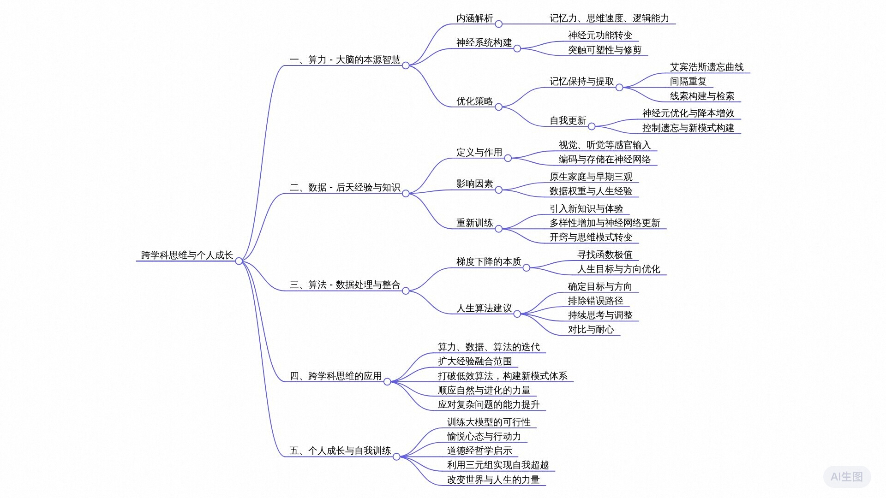

# 为什么命运很难改变？一个视频讲透人生的底层逻辑【我们每个人都在训练自己的大模型】

[为什么命运很难改变？一个视频讲透人生的底层逻辑【我们每个人都在训练自己的大模型】_哔哩哔哩_bilibili](https://www.bilibili.com/video/BV1Ri421U73J/)

大家应该听过这么一句话，对于一个手上只有锤子的人来说，任何问题看起来都是钉子。这种倾向竟然会导致可怕的后果。就如同AI发展，如果从一开始就只发挥计算优势，这把锤子去暴力破解所有人类知识，但它就永远不会拥有如今的智能。而纠正锤子的方法就是跨学科，直接从计算机科学出发，结合统计学、符号学、脑科学、自然语言科学等等多种领域和学科的知识交叉，发展出了GPT4这样的人造智慧。而仅仅依赖算力上限，则不过是GPT2这样的技术工具。

和A一样，如果一个人拥有多种能力，就像是带上了多种工具，可以直观减少锤子带来的思维局限。这些工具有很多形式，但归纳来看其实就是AI最核心的三元组算力数据和算法。算力可以类比于我们大脑的本源智慧，它决定了我们理解和学习知识的效率。数据则是我们从出生到现在所接触的一些书本知识和实际生活经验，它构成了我们对世界的认知。算法代表人生不断优化的方式，比如学习、思考和行为模式等等，所谓知行合一就是一种高级算法。

先来看第一元素算力，它的表现有很多种，记忆力、思维速度、逻辑能力等等，他们共同决定了我们确认自己大脑模型的效率，彼此相辅相成，构成了一套复杂神经系统。遵循第一性原理，我们可以从最基础的一点激励出发。先问大家一个问题，为什么我们很难回忆起边缘时发生的事情呢？对比AI的回忆机制，其实我们所谓的忘记了可以分为三种情况，压根没记住，记住了但没保持，保持了但提取不出来。除去个别先天性大脑功能缺失，一般人失去婴儿时期的记忆主要是后两种情况。这也正是我们生活中经常遇到的脑子卡壳，它大大影响了我们大脑运转效率，有时甚至会在某些人生重要节点上突然忘记很重要的事情，导致了吴昱熙的人生轨迹变化。

那么如何通过记忆来优化我们自己的大模型呢？首先需要解决的是记忆保持。人在发育过程中会伴随着部分神经元功能的转变。在发育早期，部分抑制性神经标记物其实是处于兴奋状态的这大大促进了突触的可塑性，也就是记住某样东西必须的一种神经过程，这在进化上是可以理解的。动物在生命早期需要快速适应环境，学会生存技能，因此需要快速学习的能力。这也是为什么儿童时期被称为学习语言和音乐的黄金时期，又或者很多人都反映自己小时候记忆能力更强的原因。

而随着发育的进行，上述神经元功能开始发生转变，由兴奋性转向抑制性，于是开始了突触修剪的剪枝过程，许多无用的记忆被剪切、被模糊，比如三岁前的记忆。这和大模型的训练启动器一样。在初始的几个轮次中，AI学到的知识由于梯度震荡，会在后续的学习轮次里逐渐弱化和遗忘。因此，保持记忆其实就是让对应记忆的神经元得到不停刺激，让他对兴奋信号更为敏感。关于这点有很多研究，其中最出名的就是艾宾浩斯遗忘曲线。虽然这个理论并不完善，也被营销号们用的太多，但借助于它的逻辑，我们可以挖掘出一些具体的建议，比如间隔重复。

这是最传统的心理学方法，常用于高效记忆和技能练习。每个人的记忆能力都是不同的，与其尝试别人的方法或是死记硬背，不如通过间隔性的复习和合理的计划安排，使得神经元激活频次更高效率也就更高。简单来说就是标记出自己遗忘对某些知识的间隔，推算出自己的遗忘频率，然后用主动的复习计划去覆盖掉这个间隔。这并这是一种很复杂的方法，有些聪明人也可以自己领悟，但难在坚持。和那些花里胡哨的记忆巧不同，间隔重复虽然节奏较慢，却能够从底层塑造大脑的记忆模块，甚至可以扩展到成千上百的记忆内容，对于外语和医学等知识尤为重要。

解决了记忆保持还有一个更常见的问题记忆提取就像是你把记忆存进了银行，你知道如何使用ATM，但偏偏忘记了密码，如何解决呢？首先是线索缺失的问题。回忆困难几乎每个人都体会过，比如见到熟人就一直叫不出名字的尴尬。但是一旦对方提示你，我们去年夏天一起去杰哥家当爪狼，玩的很开心，大多数人就能瞬间回忆起来。

对人类的大脑模型而言，每样东西都是由特定的线索构成。事件记忆是由时间、地点、人物、干什么、当时的情绪所构成的一个模式。网络每个要素都和其他要素相关联，互为线索。对于我们来说，往往只需要一两个具备特异性的关键线索被激活，网络就能把整个事件提取出来。所以在记忆之时主动进行线索的归纳，构建一套成体系的检索方式，可以减少抑制性神经递质。以此为基础也衍生了很多方法。比如记忆供电，它的核心就是在大脑中建立一套固定的序位系统在记忆新知识时，通过联想和想象，把知识按顺序焊接在与其对应的有序定位元素上，从而实现快速保存和提取。

现在我们知道，间隔重复和记忆检索可以用来加强记忆力，但人类大脑的存储是有限的，所以还需要通过遗忘来完成更新。如何实现自我更新呢？我们需要先了解欲望的本质。人类大脑的发育过程不是产生新的神经元，建立新的图谱连接，而是先构造出一个上百亿神经元的最高复杂度网络，根据后天自己去优化。所谓优化，就是干掉长期没有激活信号的突出，优化到长期不活跃的神经元。在总是产生同样反应的神经元中，只保留一个抑制总是发生大脑广播风暴的神经回路。超体里所谓的大脑的开发度，其实就是很多被优化掉的神经元没有发挥作用，让大脑看起来只有少部分激活区域，但其实这只是大脑降本增效的外在表现。这种机制非常复杂，涉及到大量的生物化学过程，但本质却很简单，因为神经元很难在后天建立新连接，细胞处在三维空间中缺乏引导，根本无法和远处某个神经元之间形成一条突出，这也解释了为什么神经损伤几乎无法自愈，或是肺部新细胞不知道该如何填充旧的空间，缺乏引导，只能瞎长，最终就是所谓的纤维化，所以大脑发育只能做减法。

一个远超正常复杂度需求的网络，其噪音是非常大的，编号的发送者和接收者间可能存在很多条路径，甚至出现回路底线。在生活中就是过度思考后大脑绝对无法平静的内耗状态，因此在没用的神经元被优化掉之前，人类很难主动产生新的记忆。还是以婴儿为例，我们在出生时对外界的感知就是一片混，充斥着大量的噪音和无意义的消息，这些刺激会在我们脑中如同回声一般反复回响，就像连绵不绝的雷霆，这也是新生儿大哭的原因之一。所以为什么小说不学语言，长大后就很难学会了？就是因为我们大脑模型在降本增效，相关的神经元一直得不到刺激，已经没有化干净了。除非能改变自我认知，否则大部分人的学习模式和思维方式在十几岁时就已经固定了，终其一生都在用孩童时期的算力去推演世界，导致平庸或者彻底脱节。而控制遗忘就是试着改变我们大脑认知遗忘过去固化的模式，让神经元进行新一轮的降本增效率，然后再用新的思维方式来学习知识。

如何实现呢？答案就在三元组中的第二元素数据中。如果说算力是先天和后天的共同结果，是伴随着哺乳类动物生长周期而发生变化的底层智慧，那么数据就是百分百的后天因素了。

一个人从牙牙学语到步入社会，所接触的一些外在环境、事件、情绪和抽象知识，都是这个世界输入给我们的数据。数据对AI而言是一个个编码，对人类也一样。我们所经历的、所看到的，通过视觉神经、听觉神经的反馈，最终被编码进大脑皮层和海马体等位置，以一种突出能记住的方式存储在神经网络中。出现的刹那，光进入你的眼睛，声音进入你的耳朵，空气进入你的鼻子，拓也划过你的舌尖，以及肌肤上感受到的第一次抚摸，这无数的感觉转化成神经电信号到达你的大脑，由此开始了你的第一次母亲训练。

在成长早期，我们所接触到的数据依赖于原生家庭，虽然是后天输入，但却很难被自我干预，能在很大程度上被动塑造了我们的早期三观的思维方式。很多人的视野情感受挫，无外乎是这部分数据的权重过大导致的缺陷。毕竟就连AI都会学习到脏数据，理论上一个完美的训练环境是不存在的。而我们的成长过程就是一个不断否定的辩证螺旋，否定我们无用的知识，锁定对人生有害的经验。但这并不意味着我们要放弃数据，相反，它是可以改变算力层面中关于记忆思维模式的关键，这个关键就是重新训练。从小到大，我们都在遵循生物本能进行着自己大模型训练，机械的重复着系统动作，企图通过大量输入输出去建模每个任务中具体的离散的知识。事实上，这种学习方式和几万年前我们的祖先学习捕猎野兽并无太大差别。但在新的时代，我们要掌握的是智人所独有的重新训练的能力。

小象池子里有少量清水，往里加入一滴墨，伴随着水分子的运动，水的颜色开始浑浊，现在问大家如何让水回到尽可能清澈的状态，答案有很多，但最简单的就是加入更多清水，借助热力学第二定律让颜色不断稀释。如果把池子比作我们的天生算力设备大脑，那么这些水就是知识数据而被默侵染的部分，代表着固有的模式，只有引入大量新知识并加以融合，才可以让原有的神经网络得到更新，这些知识可以是书籍，也可以是见闻，甚至是游戏里获得的情境感知。古人云，读万卷书，行万里路，当一个人不再被困于日复一日的重复循环，才会有启动神经网络二次更新的可能，从而降低升降，去学习到权重，赋予自己心声，也就是人们口中的开窍。有的人十几岁开窍，成绩突飞猛进，有的人到中年才领悟乘风而起，这听起来似乎有些天方夜谭。但实际执行起来，却不过是些细微的小事。正所谓大道至简，恰恰是这些不起眼的学习经历与体验，还增加了模型训练数据的多样性，让我们将过去数据占比变得更小。然后利用人类与生俱来的遗忘机制，引导这部分神经元抑制激活自体向上的改变思维习惯。

当然一味的往池子里加水并不是最终目的，我们还要知道怎么把水加工成我们想要的样子。所谓上善若水，人如事AI亦无事。所以我们需要第三个元素，算法，算法就是对数据的处理、整合再加工，就让这些知识在算力的作用下变成我们人生前进的养料。

而AI算法的本质是什么呢？答案是梯度下降。所谓梯度是对矢量的一种抽象概念，越是严谨性我们可以把它想象成坡度，梯度下降就找到一个函数的极值，当然这个函数一般具有对称性，所以我们也可以把函数颠倒，此时梯度下降法就变成了坡度上升法。

如果把人生比作爬山，山顶所在之处就代表符合预期的人生。山上布满时间的浓雾，能见度很低。我们每个人都是从山脚出发，只能看到身后走过的路。因此如何优化自己的路径，更好的找到上山的路，就是人生成长的算法。由于迷雾的存在，上山的路径我们无法确定，因此必须利用自己已知的信息去搜索自由路径。当然在三维生物的角度上，我们无法知道这个最优到底是局部最优还是全局最优。但这不妨碍我们先排除其他错误路径，比如向下走的路，再然后我们就可以利用梯度算法来帮助自己上山，也就是以当前所处位置为基准，寻找半径范围内最陡峭的地方，然后朝着山的高度上升的方向走，每走一段距离都停下来思考、观察，反复进行同一个方法，最后就能成功抵达山顶。

这个陡峭其实很好理解，比如学习一个门槛很高的技能，寻找一个潜力很大的行业风口，完成一件费时费力的项目等等。但我们大多数人都有着各种各样的问题，比如因为走俏路爬起来太累，出于天性我们不想吃苦，于是便半途而废。当然，如果心态不好，在半山腰上躺平也是个好的选择。

但大多数人并不甘心。一面憧憬着山顶的景色，一面又对爬山充满抵触，于是便日复一日的陷在这种精神内耗中。到最后，光是这种矛盾本身所消耗的心力，就已经超过了爬上山顶的苦难。剩下少部分人中，有人想寻找捷径，却不慎失足跌落山谷。有的人见山不是山，他钻进了人群，向山下走去。这也都是人生算法的多样性，而如果你想通过梯度算法来优化人生，那么可以参考下面几个建议，第一，找准目标与方向，确定自己想要爬上的山峰是哪座，金钱、名利还是健康。但不管是哪个，要记住坚持爬。

第二，立足当前没有过去的经验数据，去寻找最后的退路方向。比如选择什么样的职业和专业，如果找不到，最优先排除错误答案。比如在2024年选择土木或其他天坑。

第三，保持思考。爬山的每一步都代表你对世界的认知。在第二元素数据中我们说过，增加是最好的训练，但有个前提，那就是有效的经验。

如果你爬了很久却发现周围景色没怎么变化，那就要注意这份走对了路。最后，除了其他爬山者，他们可能每一步都在你前面。但AI训练中前期的速度不代表最终成就，只要掌握三元组，保持耐心，总会找到属于自己的自由己。当然就像幼儿时期我们大脑训练会带来神经元大量变化一样，在人生的每一步里，我们其实都在试图改变自己的大模型参数改变意味着不确定甚至是痛苦，但范敏说的新生模型才是开启人生第二次训练的基石。

有了对三元组的深入了解后，所谓的跨学科思维也就不难理解了。在数据、算力和算法的迭代过程中将思维跳脱出某个单一的知识结构，扩大经验的融合范围，打破原来的低效算法，最终构建起全新的模式体系。正是这种能力赋予了人类祖先顺应自然的力量，从无数物种之中幸存进化。

在这个瞬息万变的AI时代，我们所面临的问题远比祖先们要复杂。曾经的我们关于算力数据和算法定式，对生活有着狭隘而抵触的心态，甚至会理所应当的觉得自己不可能成功，然后就什么都不去做了。但通过今天的拆解，我希望大家能意识到，训练自己的大模型从来都不是什么困难的事，抱着愉悦的心情去做，那么不论应试、求职还是人生，都将顺理成章。

道德经有云，一生二二生3，三生万物，万物无穷尽。我们终其一生都无法建模，但通过三元组的跨学科思维，我们就能掌握自己最本源的先天一气。它能改变这个世界的进化历史，也有着改变我们一生的力量。它像一把巨火，在漫漫长夜中追着我们走过蜿蜒崎岖的登山之路。如何利用它，让自己的人生变得更好，是一道留给大家的没有上交期限的课后题。

---

## 关键词

跨学科 AI发展 GPT4 算力 数据 算法 记忆保持 间隔重复 记忆提取 神经元 大脑模型 自我更新 重新训练 梯度下降 人生算法 三元组 跨学科思维 AI时代 应试 求职 

## 全文摘要

在探讨AI发展时，指出若仅看重计算能力，可能忽视智能核心，强调跨学科融合（如统计学、符号学、脑科学）是关键。比喻称，只握锤子者视一切为钉子，象征单一视角限制。文章提倡拥有多元技能，通过算力、数据与算法优化学习过程。提出通过增强记忆保持、有效检索与算法重训，优化“大脑模型”，提升学习与适应。运用新数据与算法优化，更新认知模型。目标是借助跨学科思维与持续学习，增强个人与AI智能。

## 章节速览

##### 00:00 跨学科融合对人工智能发展的重要性

对话强调了跨学科融合在人工智能发展中的重要性，指出单纯依赖计算优势和算力上限无法实现真正的智能。通过结合计算机科学、统计学、符号学、脑科学、自然语言科学等领域的知识，可以发展出如GPT4这样的人造智慧。此外，还讨论了AI与人类智慧的核心三元组——算力、数据和算法，及其在记忆、学习和优化中的应用，强调了这三者在构建复杂神经系统和提高大脑运转效率中的作用。

##### 01:49 通过记忆优化大模型：从神经科学到学习策略

记忆保持是优化大模型的关键，其原理源于神经元功能的转变与突触可塑性。早期神经元的兴奋状态促进了快速学习，而随着发育，抑制性功能的转变导致记忆的剪枝。借鉴艾宾浩斯遗忘曲线，间隔重复成为一种有效的记忆强化策略，通过合理安排复习计划，提高神经元激活频次，从而在底层塑造大脑的记忆模块，尤其适用于外语和医学等知识的学习。尽管节奏较慢，但这一方法能有效覆盖遗忘间隔，实现成千上百的记忆内容的优化。

##### 03:37 解决记忆提取问题和大脑优化机制

记忆提取的挑战可以通过构建有效的线索和检索系统来解决，比如通过记忆宫殿方法将新知识与有序定位元素关联，从而实现快速记忆和提取。人类大脑通过遗忘和优化过程进行自我更新，即通过消除长期未激活的神经元和突触来降本增效，这一过程涉及复杂的生物化学过程，但本质是通过减少不必要的神经元连接来提高效率。

##### 05:39 大脑认知与学习模式的重塑

对话探讨了大脑在处理复杂信息时的噪音问题，以及过度思考导致的内耗状态，类比为婴儿对外界感知的混沌状态。指出随着年龄增长，大脑为了降本增效，会优化掉未被持续刺激的神经元，这解释了为何成年人学习新语言更为困难。强调了数据作为后天因素对个体认知和学习的重要性，通过不断的刺激和重塑神经网络，可以改变自我认知和学习模式，实现控制遗忘和新知识的学习。

##### 07:23 通过重新训练重塑个人成长

在成长早期，原生家庭对我们的三观和思维方式有重要影响，这可能导致一些固有的缺陷。随着成长，我们可以通过引入大量新知识和经验，对大脑进行重新训练，以更新原有的神经网络和思维模式。这包括阅读、旅行、体验游戏等多种方式，增加模型训练数据的多样性，从而降低旧数据的权重，实现思维习惯的改变。通过这一过程，人们可以在不同年龄段实现“开窍”，获得新的认知和成长。

##### 09:28 人生算法：梯度下降与成长路径

将人生比作爬山，利用梯度下降算法优化个人成长路径。通过不断寻找最陡峭的地方并朝着山的高度上升的方向前进，即使在迷雾中也能逐步接近目标，最终达到山顶，实现符合预期的人生。尽管无法确定找到的是局部最优还是全局最优，但通过排除错误路径和反复应用梯度算法，可以有效优化上山的路径。

##### 10:50 人生算法的优化与跨学科思维

通过类比攀登陡峭的山峰，讨论了面对高门槛技能、行业风口或大型项目时，多数人常陷入的精神内耗和矛盾。提出利用梯度算法优化人生，建议包括找准目标方向、立足当前寻找正确路径、保持持续的思考以及借鉴跨学科思维，以实现人生的大模型参数优化。强调了在AI时代，通过理解和运用三元组（数据、算力、算法）的跨学科思维，可以构建全新的模式体系，改变人生并适应复杂多变的环境。

## 思维导图

## 要点回顾

##### AI的发展过程中，如何避免只依赖计算优势而忽视其他领域知识，导致智能受限？

纠正这种倾向的方法是跨学科融合，从计算机科学出发，结合统计学、符号学、脑科学、自然语言科学等多领域知识交叉，发展出了GPT4这样的人造智慧，而非仅仅依靠算力上限。

##### AI的核心三元组组成部分是什么？它们各自的作用是什么？

AI的核心三元组是算力、数据和算法。算力类比于大脑本源智慧，决定了理解和学习知识的效率；数据构成了我们对世界的认知基础；算法则是优化我们学习、思考和行为模式的高级方式。

##### 为什么人类难以回忆起边缘时发生的事情，这与AI的回忆机制有何异同？

人类遗忘可以分为三种情况：没记住、记住了但没保持、保持了但提取不出来。而AI的回忆机制也存在类似问题，但两者原因不尽相同。解决人类记忆问题的方法之一是通过艾宾浩斯遗忘曲线理论，比如间隔重复的方法来提高记忆效率。

##### 如何通过记忆保持来优化大脑模型？

保持记忆的关键在于让对应记忆的神经元持续得到刺激，使其对兴奋信号更为敏感。可以通过艾宾浩斯遗忘曲线规律进行间隔重复的学习和复习，以提高记忆模块效率，尤其适用于外语和医学等大量知识的学习。

##### 如何解决记忆提取的问题，比如如何正确使用“密码”（线索）提取记忆？

记忆提取需要构建一套成体系的检索方式，每个记忆由特定线索构成，通过激活一两个关键线索，就能引发整个事件的记忆提取。例如，记忆供电法通过联想和想象将新知识有序焊接在大脑中的固定位置上，便于快速保存和提取。

##### 如何实现自我更新以及优化大脑网络？

大脑通过遗忘机制完成更新，即优化掉长期不活跃的神经元和神经回路，只保留关键有效的部分。婴儿时期的大脑发育过程就是通过构建一个复杂度网络并不断优化来实现的，这个过程无法通过增加新的神经元连接来完成，而是通过减少无用的神经元连接以降低能耗，提高效率。

##### 数据对AI和人类而言具有怎样的重要意义？

数据对于AI来说是编码的信息，对人类而言则是经历、事件、情绪和抽象知识等外在环境输入的大脑编码。这些编码在神经网络中存储并塑造了我们的记忆、思维方式以及早期形成的三观。

##### 早期接触的数据如何影响个人成长和三观形成？如何理解重新训练在改变算力和思维模式中的作用？

在成长早期，我们接触到的数据很大程度上依赖于原生家庭，虽是后天输入但不易被自我干预，能被动塑造早期三观和思维方式。若数据权重过大或包含有害信息，可能导致视野受限或情感受挫。重新训练是通过引入大量新知识并与原有知识融合，更新和优化神经网络的过程。这类似于借助新知识“加水”以稀释原有“墨水”，从而改善认知结构和思维模式。

##### 算法在AI和人类学习过程中扮演什么角色？

算法是对数据进行处理、整合再加工的过程，它让知识在算力作用下转化为人生前进的动力。在AI中，算法本质是梯度下降，帮助找到函数极值，而在人生中，则表现为寻找上山的最佳路径，不断排除错误选项，利用梯度算法（坡度上升法）提升自我。

##### 如何运用梯度算法优化人生路径？

运用梯度算法优化人生路径需要找准目标与方向，立足当前排除错误答案，并保持持续思考。每一步都应是对世界的认知深化，如同AI训练中增加有效经验一样重要。同时，要有耐心，掌握三元组，不断改变和适应，开启人生第二次训练。

##### 跨学科思维如何助力人生进化和问题解决？

跨学科思维将思维跳出单一知识结构，融合多元经验，打破低效算法，构建全新模式体系，赋予人类顺应自然、进化生存的能力。在AI时代，正确理解和应用三元组，可以让我们掌握先天一气，改变世界进化历史，也能让个人生活变得更好。

