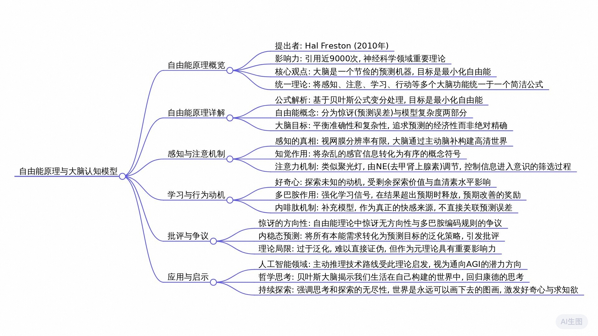

# 大脑：节俭的预测机器

https://www.bilibili.com/video/BV1Rj53z3EoX?spm_id_from=333.1387.favlist.content.click

每次看到有关AI新进展的介绍，下面总会有这样的评论：“AI压根没有真正的理解，只是在预测概率而已。”是的，这确实没错。但问题是人脑呢？

## 自由能原理的诞生与意义

2010年，神经科学家Hal Freston发表了一篇论文，引起了巨大轰动，至今引用量近9000次，被誉为过去20年神经科学界最重要的理论性工作，没有之一。这篇论文用一个简洁的公式统一了感知、注意、学习、行动等多个层次的大脑功能，这不仅极大地推动了我们对大脑运作机制的理解，也为人工智能领域的主动推理路线提供了重要的理论支点。它是认知科学的一个大一统理论，也是我们理解并提升自己的一个绝佳工具。他提出了一个震撼而简单的观点：大脑的本质是一个节俭的预测机器。我们来了解一下自由能原理。

有一些上学要读书，你好，我是是不是难受了呢？在我说出“我是”两个字之后，你的大脑已经做出预测，接下来要听到一个名字，但这个名字迟迟没有出现，你的预测失败了，让你感到一丝惊讶，这正是大脑最不喜欢的事情。实际上你脑中上千亿个神经元日夜不停地忙碌，只为了一个终极目标：最小化惊讶总量。

### 自由能公式的解读

我们直入主题看看这个公式。这个公式看似很复杂，实际也一点也不简单。但如果你恰巧熟悉统计力学或者机器学习，不难发现这个公式无非就是把贝叶斯公式进行了变分处理。这个公式想告诉我们，大脑的所有运算都是为了让一个量最小化，这个量被命名为“自由能”，这多少有点硬蹭物理学的嫌疑。

那说人话是什么意思呢？自由能可以拆分为两项，和后面这两项可以进行非常简单的理解。前一部分是惊讶，也就是预测的误差，后一部分不精确地说，是模型的信息熵，也就是复杂度。所以说大脑实际上有两个目标：

1.  一个是让世界尽可能地符合预期，让惊讶的总量尽可能的小。
2.  另一个目标是不要使用过于复杂的认知模型，让理解世界的成本尽可能地低。

换句话说，虽然大脑是一个预测机器，但并不追求绝对完美的预测，也是要考虑预算的，要在准确性和复杂性之间保持平衡。我们不是在追求真相，我们只是在努力不被现实击垮。

不难发现，“自由能”这个名词是为了和热力学中的自由能进行呼应。两个公式中都是要取得自由能最小化，但熵的符号相反，我们可以进行不准确的概括：天道熵增，人道熵减。其实这个公式还可以进行更细致的拆分，来更好地解释我们的认知活动规律。但今天先不展开，这是我们下期视频的主题。

### 理论的联结性

今天先说回这篇论文。实际上这个公式借用自统计物理和机器学习，并非原创。这篇论文真正牛的地方在于，它用这么一个简单的总目标，把神经科学诸多不同层面的理论全部串联到了一起，包括但不限于贝叶斯脑假说、精度加权原理、预测编码理论、强化学习等。之前散落的诸多理论，现在都可以用这一句话进行统一：大脑是一个节俭的预测机器。大脑的活动太复杂了，我们简化一下，大致拆分为四个环节：感知、注意、学习、行动，分别对应控制理论中的输入、调节、更新、输出。

而这篇论文的核心观点就是这一切都是围绕最小化自由能这个目标展开的。我们一个一个来看。

## 感知：大脑的主动建模

先来看看我们的感知，我们看到的真的是我们看到的吗？你看到的世界清晰吗？我不是在问你的眼镜度数，你可以戴着眼镜回答我下面的问题。我是在问你感觉你的视网膜分辨率有多少？有4K吗？还是1080P或者360P？我相信你的回答至少应该在1080P以上，不然的话看高清视频不就没有意义了吗？实际上你视网膜上绝大部分区域的分辨率都低得可怜，可能不足240P。你或许会说不可能，绝对不可能，我看到的世界老清晰了，真的吗？

不妨做个小实验，现在你伸直右手，伸出大拇指，眼睛盯住你的指甲盖儿，注意控制眼球不要转动。接下来在眼球不动的前提下，试着把注意力放在指甲盖以外的区域，你还能看得清吗？这才是你视网膜上大部分区域的真实分辨率。视网膜上的高清区只有你现在眼中的指甲盖这么一点点大小，实际上视网膜上甚至有两个完全看不见东西的盲区，是视网膜与视神经连接的地方，压根儿没有感光细胞。如果你感兴趣，搜索“视野盲区”，有一些专门的视频能让你意识到它们的存在，你之前发现这些了吗？

你是不是感觉自己的视觉世界总是高清、连贯、稳定，只是因为你被你的大脑欺骗了？实际上，眼睛输入给我们的信息非常有限，眼睛只是提供了一点点模糊、碎片化甚至断点的信息。我们之所以能生活在一个高清、连贯、稳定的世界里，全靠大脑主动脑补出来的模型。大脑从来不是一个被动的信号接收器，而是一个主动的世界模型生成者。它生成了我们的视觉世界，并一刻不停地对比视神经上传的信号，用新接收到的信息进行校准。一旦发现预测与现实不符，也就是产生了惊讶，就会主动调整世界模型，就是为了让未来出现的惊讶最小。这就是我们赖以生存的感官世界真实的运作方式。

### 知觉：感官世界的解释器

但你可能要问，大脑是根据什么来预测的？它又怎么知道世界该是什么样子的呢？那么我们就必须介绍一个关键概念了：知觉。如果你熟悉人工智能领域的图像识别，这个概念就不难理解了。知觉就是大脑内置的图像识别系统。

一方面，知觉对接感官器官，它的输入是感觉，是一大堆杂乱的像素、频率、亮度、颜色和触感。另一方面，知觉对接认知系统，它的输出是意义，是有序的符号、概念与描述。正是知觉让你能从纷繁的信息流中准确地识别出天空、大地、桌子和猫咪。借用哲学语言，输入知觉的是杂多，而知觉输出的是符号秩序，知觉就是这其中的桥梁。

当你看到一个人时，你并非只是捕捉了光的频率，更是在大脑中激活了一个“人”的概念符号。当你听到一句话，你并非只是接受了声波信号，而是同时在大脑中唤起了语义结构。你也许会觉得这样的功能平淡无奇，天经地义，但实际上人类为了让AI获得这样的能力费尽了苦心。知觉是我们将感官世界编译为内在语言的接口，是大脑对世界的第一层解释器，也是我们对世界的第一重简化，大大降低了理解世界的成本。为了不被信息洪流所淹没，我们的大脑还设置了第二道关键的筛选机制：注意力。

## 注意力：聚光灯的掌控者

有时候你身处人群之中，但心里只想着昨天看过的一本小说。朋友们嘈杂的谈话和背景的噪音一样被你自动过滤，并未进入你的世界。有时候你在地铁里同千万人擦肩而过，但你沉浸在即将到来的会议发言中，这些人影进入了你的眼睛，但没有进入你的意识。你的内心世界是一个舞台，信息的洪流奔涌不息，而注意力是一盏聚光灯。正如胡塞尔所言，唯有进入注意光束的内容才获得清晰与确定，其他一切都隐没于阴影之中。

那么，是谁在掌控这盏聚光灯呢？我们先不深入到具体的脑区，来看一个老朋友：去甲肾上腺素（NE）。我们已经知道大脑面对惊讶，也就是预测误差的时候，会依据误差调整内部参数，以降低未来的惊讶总量。但大脑非常聪明，并非所有的预测误差都会被给予同等的对待，而是要依据精度给不同的误差赋予不同的权重。有些感知信号不稳定，即使它和预测偏差很大，大脑也不当回事。有些信号很可靠，哪怕偏差很小，也会引发大脑立刻重视调整模型。

在贝叶斯框架中，精度其实就是预测误差的不确定性的倒数，这就是精度加权原理。这里有非常严密精准的数学，但我们不去展开。有意思的是，NE系统正是这套理论中精度信号的调节因子。

NE水平上升时，系统对特定感官通道或预测误差赋予更高信任，这决定了哪些信号可以上报给全脑，进入聚光灯之中。举个例子，你在地铁里听着音乐时，突然有人喊你的名字。如果这个名字只是嘈杂环境中的模糊声音，由于精度低，你可能毫不在意。但如果这个声音清晰、熟悉且明显，你便会立即转过头去确认。实际上这两个声音可能都是误差，但大脑只信赖值得信赖的信息。

另外，NE除了会被具体的事件激活以外，背景式的全局NE水平也对我们影响很大。背景NE上升意味着大脑对所有的信息都赋予了较高的权重，变得对所有刺激都非常敏感，随时做好了接受新信息的准备，这是一种警觉状态。在这种状态中，大脑如何评估原本世界模型的可靠性至关重要。如果大脑认为原本的模型非常可靠，那么你会进入一种高度专注的状态。如果系统判断你原本的模型已经不再适用，那么你将进入一种风声鹤唳、草木皆兵的躁动状态，坐立不安、易怒，莫名其妙地对平常无感的事情格外在意。

那么什么决定了大脑对原本世界模型的可靠度呢？老朋友应该发现了，那就是血清素。在这个计算模型中，血清素是一个关键的全局参数，代表着大脑对现有模型的信任程度。以上这些机制与我们上一期视频中的情绪模型高度吻合。

## 探索与学习：好奇心与多巴胺

你看到这儿也许有疑问了，如果说大脑所做的一切都是为了最小化惊讶，那我们待在熟悉的舒适圈不就完了，为什么还会去主动探索未知呢？你出差来到一个陌生的城市，一个世界级难题摆在你面前：晚饭吃什么？现在你眼前有两个选项：
1.  选择久经考验的全国连锁品牌海某捞，非常稳健，不会出错。
2.  探索当地特色小店，上限很高，而下线也很低。

按照前面介绍的自由能原理，大脑既然是一个极力避免惊讶的预测机器，那我们是不是总应该选择安全而稳妥的选项呢？不是的，我们的大脑不仅仅关注这次行为带来的惊讶，还要考虑长期的影响。假如你只在这个城市待两天，那么选择熟悉的连锁品牌当然更加合理，但如果你即将在这个城市常住几个月，情况就完全不同了。此时，在最初几天稍微冒险去探索未知的餐厅反而可能更有价值，因为你获取的信息可以更新你的预测模型，大幅减少未来几个月中惊讶的总量。如果我们把未来的这种潜在信息收益贴现到当下的决策，便形成了一种特殊的行为动机：好奇心。

从这个例子不难看出，影响好奇心的主要因素是某一领域潜在的探索价值。剩余的旅途越长，探索的价值越大。而人生不就是一场漫长的旅途吗？青少年时期，来日方长，我们思维开放，充满了对未知世界的探索欲望。而步入中年以后，剩余旅途的探索价值降低，我们的行动也会更倾向于保守，不再愿意踏出舒适圈。“四十不惑”，对于很多人来说，并不是因为想明白了什么，而是放弃了好奇，不打算“惑”了。因为随着年龄增长、环境稳定，探索未知所能带来的未来信息价值，已经很难再超过当下冒险可能带来的惊讶成本。要是这么说，陌生环境总是能带来更高的信息回报，尤其对少男少女而言更是如此。

为什么我们仍常常停留在舒适圈，不愿意探索呢？这就涉及到另外一个关键因素了：血清素。我们已经知道在这个模型中，血清素的意义是对现有世界模型的置信度。高血清素意味着大脑认为现在的模型可以信赖，踏入陌生环境不会被过量的惊讶击垮，这让我们更愿意主动探索。而低血清素意味着大脑对现在的模型并不信任。痛苦促使我们减少行动而更多反思，直到建立更稳固的底层模型。最深刻的反思往往来自最刻骨的痛苦。因此，旺盛的好奇心来自高血清素加上强的探索价值，这两个条件都具备的时候，一种与好奇心高度相关的神经递质就会释放：乙酰胆碱，它会提升我们大脑的神经可塑性，让我们打开学习模式。

### 多巴胺与学习信号

但这仅仅是打开了学习模式而已，具体的学习过程又和什么递质有关呢？你应该猜到了吧，就是多巴胺。2014年，AlphaGo战胜李世石，引发全球关注。在它的算法中有一个核心机制叫RPE（奖励预测误差），这是强化学习里的学习信号。DeepMind在论文中明确指出：“我们使用RPE作为学习信号，类似于多巴胺在大脑中的作用。”这背后有非常严谨复杂的数学，我们尽可能做一个易于理解的介绍。

围棋比赛理论上要走满全局才能分出胜负，但懂棋的人都知道，大多数对局远在终局之前，胜负就已经分晓。这是因为我们掌握围棋比赛的运行逻辑，能够提前预测局势的走向。因此在下到第200手的时候，白方投子认负，黑方提前确认了胜利。这就是一个多巴胺释放的瞬间。由于预测的存在，我们在心理上预知了未来的胜利。我们不妨借用会计中的一个术语：“计提”。计提的意思是，如果可以预见到未来的某项损失，那么这部分损失就应该提前反映到本期账面上。我们借用这个词，不只是损失可以计提，快乐也可以。当能预期到的结果突然变好，大脑便释放多巴胺。它不是在庆祝结果本身，而是在庆祝预期的改善。

当我们回到围棋比赛现场，实际上在第200手的时候，白方认负，胜利的黑方内心非常平静，仅仅释放了一点点多巴胺。为什么？因为早在第99手，他已经下出了神之一手，就在那一瞬间，胜利的天平就已经大幅倾斜。黑方的大脑在那一刻就释放了大量多巴胺，此后的101手不过是将既定的结局缓慢兑现，在这段过程中，激动逐渐沉淀为平静。所以说究竟什么时候释放多巴胺呢？不是在结果兑现之时，而是在结果超出预期之时。完全在意料之中的胜利不会让我们兴奋。只有当世界比我们想象的更好，大脑才会报以奖励。

巴甫洛夫的狗听到铃铛会流口水，是因为它建立了铃铛和食物之间的关联，因此真的吃到食物的时候反而分泌的多巴胺很少，除非食物的量或者美味程度超出预期。而摇铃这件事情的发生是意料之外的，因此这一刻多巴胺释放很多。更进一步，如果在每次摇铃之前都会固定的先摸摸头，那么多巴胺的分泌就会提前到摸摸头的那一刻，因为此时铃铛已经变得可以预测，不会带来新的信息。我们可以说“计提”又提前了。正是在这一系列“计提”不断提前的过程中，真正的学习发生了，狗的大脑建立起了摸头、铃铛、食物之间的因果链条。多巴胺就是这套学习机制的核心信号，它帮助我们不断调整内部模型，以更好地预测世界的运行，从而减少未来的惊讶。

### 自由能理论的争议与完善

但这里有一个争议性问题，也就是自由能原理最常被质疑的一个核心点。RPE是有明确的好坏方向的，多巴胺的编码规则显然也带有明显的方向性，只在结果好于预期的时候释放，而惊讶本身是无方向的。那这个好坏从何而来呢？对于围棋比赛来说，毫无疑问最终的胜利与否就是好坏的判断依据。中间的RPE信号都可以理解为对最终胜利结果的计提。

那多巴胺是在计提什么？在自由能原理的大一统理论中，一切都是为了最小化自由能。因此这个模型认为多巴胺是在计提误差偏离的减少，但是多多少少有点牵强。

为了让理论统一，自由能模型采用了一个泛化策略，他把所有的人类本能需求都转化成了预测目标，这被称为内稳态预测。所有的身体需求都被标记为一种稳态的预测。我们对美食的渴望是因为身体偏离了对能量状态的预测，我们对性的欲望是因为行为频率未达成内在预测值。所有动机本质都是为了减少这种偏离，回归被预测的状态，这似乎也说得通，但确实过于泛化和牵强，这也是自由能理论被批评得最多的点。以我个人非常浅薄的理解，如果放弃大一统的美感，加一个补丁，补充上内啡肽机制，作为计算系统之外的终点奖励机制，那么多巴胺与RPE作为中间奖励信号的作用就会形成完美类比。

我们现在简单了解一下内啡肽。它是真正的快感，它与传递痛感的P物质相拮抗，因此可以镇痛。除了这个作用之外，它就是基因内置到我们身体里的奖励系统，那它在什么时候分泌呢？很简单，当我们活成了基因想要的样子：
1.  首先是性，这点不用多说，这是内啡肽最原始最重要的作用，也是基因的复制愿望在我们身上最深的烙印。多少螳螂甘愿为此赴死？
2.  其次是食物，尤其是辣味。这倒不是说辣椒能给我们带来什么生存繁衍优势，仅仅是被辣椒素卡到了bug。
3.  饮食男女之外，内啡肽还会奖励我们肾上腺素、多巴胺、血清素“三安”俱高的巅峰体验，包括但不限于大笑、顿悟、心流、与朋友深度共鸣的交谈。这便是内啡肽在告诉我们此刻活得不错。

让我们回到围棋比赛现场，黑棋棋手下出了神之一手，落子的瞬间他的颅内多巴胺高涨，因为胜利已经被计提，由此获得了巨大的行为动机与心理兴奋。接下来的每一步都只是在兑现他一个已经预见的未来。终点站的来临之时，裁判宣布比赛结束，白棋认负，全场寂静。他赢了，赢得了一笔不菲的奖金，但他的内心并无波澜。金钱不会直接触发我们的快感机制，它带来的是对未来奖励的想象和调动，金钱是最常见的快乐计提工具，拿到钱可以换来自由，可以换来安全，可以换来便利，但这些都只是多巴胺许诺的预期，而真正让我们感到快感的不是金钱本身，而是那些时刻我们吃下美食，亲吻爱人，挑战自己。所以那一天他最快乐的时候不是领奖的瞬间，而就是他沉浸在围棋游戏过程里的时候。他沉浸其中，物我两忘，达到了心流状态，灵感迸发，下出了神之一手。回过神来的时候，环顾四周，踌躇满志，三安俱高，内啡肽释放。

## 狭义计算大脑与外源性动机

让我们再次回到我们的矩阵，我们获得了一个关于大脑的大一统解释。大脑是一个节俭的预测机器，由此对认知、注意、学习和部分行为获得了更深入的理解。但这个模型在解释行为价值动机的来源部分稍有不足。但其实我们可以这样理解，它描述的是一个狭义的计算大脑，一个不包含其他外来动机的纯粹的预测工具，来自于单纯的智能选择的演化压力，谁预测得准，谁的生存概率就高，由此内生出好奇、自洽这样的内在动机。而那些我们其他的需求，比如食欲、性欲、归属感、权力欲，则来自计算大脑之外的系统，比如内啡肽、催产素等。从这些机制，它们与减少惊讶无关，而是来自另外的演化压力。从自由能模型的视角看，它们是外源性的动机，而非大脑的内在目标。而情绪系统是一个交界地带。

三种单胺一方面受外来动机的影响，另一方面也是大脑运行的中间参数。NE调节注意系统，多巴胺参与学习活动，血清素影响探索行为。除了过于扩大化惊讶的解释以外，这个理论还有什么批评呢？对自由能理论最大的批评主要在于作为一个关于理论的理论，过于泛化难以直接证伪。但在我看来，这无法避免，这是一个高阶的元理论所注定承受的批评。以上是关于自由能原理的极简介绍，我们在中间穿插了几种神经递质在大脑中作用的说明。论文原文中有详细的数学推导，扎实的神经科学基础，还有拓展至演化论、博弈论乃至物理学的延伸思考，感兴趣且有一定数学或者统计物理基础的朋友推荐深入阅读。

作为一篇脑科学论文来说，它堪称惊艳。但作为野心过于庞大的大一统理论来说，目前尚未完全成为神经科学领域的主流。但毫无疑问，在这个领域，它是过去20年里影响最大的理论。对于神经科学家来说，也许会反驳它，但绝对无法忽视它。在人工智能领域，以这一套理论为启发的一类主动推理技术路线近来正逐渐受到重视。它试图将生物大脑的预测机制与人工智能中的规划与推理能力结合起来，甚至被一部分研究者视为通向AGI（通用人工智能）最具潜力的方向之一。如果你恰好是做人工智能研究的，不妨留意一下这条路线，或许能为你现在的工作带来一丝启发。如果你身边有做AI的朋友，不妨把这个视频转发给他，说不定他未来的图灵奖致辞里会提到你和我。

## 康德与世界的真相

而对于我一个纯粹出于求知兴趣的人来说，这个理论真正打动我的并不是它的工程前景，也不是它的系统美感，而是它的核心基础——贝叶斯公式。它又一次带给我那个熟悉的感觉：怎么又回到康德了？在我个人的阅读生活中有一个反复出现的奇妙现象。每当我我觉得终于弄清楚了一个重要的问题，最后总会惊讶地发现又一次回到了康德。在思想史上，康德似乎是一座无法绕开的桥，此前的哲学在这里汇聚，此后的哲学从这里分流。从黑格尔到叔本华，从维特根斯坦到丹尼尔·丹内特，似乎所有伟大的思想家都在用自己的方式接续康德。

贝叶斯大脑实际上告诉我们这样一件事儿：我们从未理解过真正的世界，而是生活在自己构建的世界中。我们总是惊叹“宇宙最不可理解的就是它居然可以理解”。而真相可能是我们理解的，从来都只是我们能理解的那一部分，就好像是光的三原色，这似乎是光的本质。我们以此为真理构建了你我眼前的屏幕，但光的频率分布从来都是均匀的。所谓三原色，是因为我们的眼睛里只有3种视锥细胞。三原色并非关于光的真相，而是关于我们自己眼睛的真相。

我们在用画笔描绘着整个世界的蓝图，有一天忽然惊呼：“我发现了一个世界的真相，世界是由颜料组成的，世界是由笔触组成的，世界是由像素组成的。”但那并非关于世界的真相，而是关于我们画布的真相。我们用画布、颜料、笔触来构建现实，但这些并非世界的结构，而是我们心智的结构，而有结构的地方就有缝隙。康德称这些深埋于思维底部的构造为“先验范畴”，其中之一便是我们赖以生存的因果律。从休谟开始，哲学家们就开始怀疑，因果律真的是世界本身的规律吗？太阳已经东升西落了100万次，但谁能证明它明天必然再次升起呢？

图灵奖得主朱迪亚·珀尔在《为什么》一书中以严密的数学工具回答了这个问题。因果关系与世界无关，而是我们大脑中的预设结构，是我们理解世界的工具之一，是我们用来描摹世界的画笔当中最精巧的一支。早期的人工智能之所以看不懂世界，正是因为它缺乏这一支因果的画笔。康德又对了，人之所以能为自然立法，并不是因为我们真正看清了世界，而是因为我们始终生活在大脑为我们描绘的那幅图景之中。我们看到的并不是世界的本来面目，而是我们自己认知画布上的颜料与笔触，而在这些笔触的缝隙中，潜藏着那个永远无法触及的存在物——“自在之物”。

“自在之物”正是这个幽暗的空白区，此后来的哲学家们用各自的方式应对它、解释它、绕过它。因为“不可知论”这四个字，让每一个认真思考的人都感到一种难以言喻的沮丧。但对于一个思考者来说，这又何尝不是一件好事呢？这意味着世界从来没有未来，也不会有盖棺定论，思考和探索永远都没有尽头。世界是一幅永远可以画下去的图画，在笔触的缝隙之中，是我们永远不会熄灭的好奇心。依稀尚存，要读书，我是何夕夕，愿你我都能永远胡思乱想，永远好奇。

