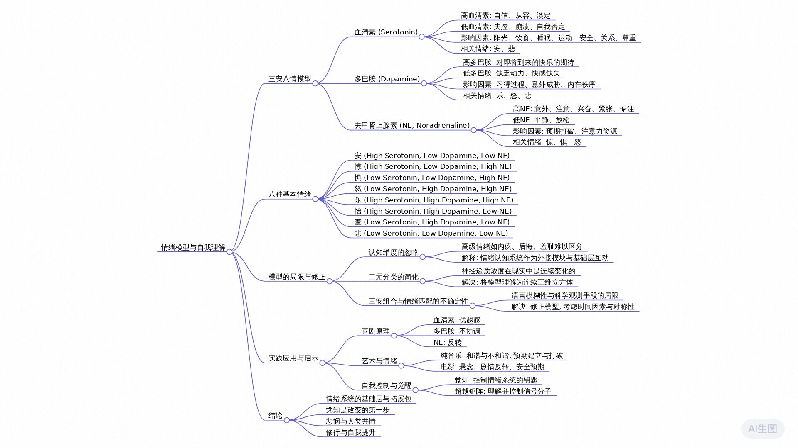

# 情绪：当前最好的科学理解模型【人性矩阵04】

[情绪：当前最好的科学理解模型【人性矩阵04】_哔哩哔哩_bilibili](https://www.bilibili.com/video/BV1KDdUYbEB2/)

## 绪论：个人经历与模型的重要性

我曾经也经历过人生的至暗时刻，抑郁、无力、自我怀疑——情绪究竟是怎么一回事？这是那段时间我思考的最多的一个问题。但那时候我能找到的理论要么过于简陋，要么干脆就是玄学。

终于在四年前，我读到了一篇2012年的论文，可以说是相见恨晚，醍醐灌顶。它把我此前零散的知识和思考全部串联了起来，以一种异常简洁而优雅的方式解决了我几乎所有的困惑。自从我把它纳入自己的认知系统，无论是对他人的理解，还是对自己的洞察，都上升了一个台阶。可以说，理解这个模型是我走出泥潭的一个开始。而直到我写稿的此刻，在中文互联网中，我没有检索到任何关于它完整的介绍，而在英文世界，它也仅仅出现在学术论文和专业论坛中。明珠暗投，宝玉蒙尘，这实在太过可惜。它值得被更多人知道，无论是痛苦的人还是好奇的人。所以你很可能是全世界最早接触到这个理论的一批人之一。

坦率地说，我做up主的初心就是想把我的这个发现分享给你——我认为它就是人类目前对于情绪最好的科学理解模型。当然它也远称不上完美，关于它的局限性我会在后面进行深刻的探讨。但在那之前我们先来看看它的基本结构。简单来说，它将情绪拆解为三个维度，而这三个维度分别对应三种神经递质：血清素、多巴胺、去甲肾上腺素。这个名字太长了，我们后文用英文简称NE。巧合的是，这三种神经递质全部都属于单胺类分子。根据它们各自高与低的组合，一共可以形成8种不同的状态，分别对应8种基本的情绪。所以从结构上看，它是一个三维八角模型，原文中把它叫做the cube of emotions，情绪立方。而2020年来自中国团队的一篇重要研究则把它叫做情绪的三原色，但我更愿意把它叫做三安八情。

依稀尚存要读书。你好，我是何夕夕。欢迎来到人性矩阵第四期情绪。我们先说三安，再讲八情。

## 三安：三种核心神经递质

### 1. 血清素：内在平和的基石

先来看看我们体内最重要的信号分子，或许没有之一：血清素。血清素又名五羟色胺，是决定我们情绪稳定性的关键分子。高血清素让人感觉自信、从容、淡定；低血清素让人感觉失控、崩溃，甚至强烈的自我否定。是的，血清素就是与抑郁症最相关的物质。最常见的抗抑郁药物SSRI就是通过延迟分解的方法，强行提高脑中血清素的水平。据我身边不止一个吃过SSRI的朋友描述，这种药物带来的感觉不是快乐，而是一种绝对的平和，似乎感觉自己达到了完满。如果用四个字形容高血清素带来的感觉，我会说是inner peace。而如果是借用佛学的词，我会说是本自具足。

那么哪些因素影响血清素水平呢？实在是太多了，但大致可以概括为以下四类：

1.  **生理层面**：阳光、饮食、睡眠、运动都会影响血清素。一个有意思的事情是，居住在高纬度地区的人们，在接近极夜的冬季会因缺乏光照而产生季节性抑郁症。在饮食方面，碳水化合物能够帮助色氨酸更顺利地进入大脑，从而促进血清素的合成。有时候你心情低落，或者莫名其妙地发火，不一定是因为谁做错了什么，很可能只是你上顿饭碳水吃得太少了。
2.  **安全层面**：当你感到环境不安全的时候，一个叫杏仁核的古老脑区就会被激活，触发战或逃模式，让你的血清素大大降低。长期或者剧烈地处于应激状态，杏仁核的体积就会变大，这是很多PTSD患者的症状。与之相反，有一种人的杏仁核小于普通人，那就是长期坚持冥想的人。有FMRI扫描结果显示，那些打坐几十年的西藏喇嘛杏仁核非常的小，这也许正是他们能够保持内在平静的生理原因。
3.  **关系层面**：亲密关系、归属感能提高血清素，相反，离别、被孤立会降低血清素，显然这与催产素有关。
4.  **尊重层面**：赢得竞争、提升地位能提高血清素，相反，竞争失败、地位下降会降低血清素，显然这与睾酮有关。

如果你恰巧熟悉心理学，你会发现这不就是马斯洛需求层次理论？是的，没错。关于血清素的研究再次告诉我们，马斯洛是对的。

以上种种纷繁复杂，但是我们可以简化为三个字：“我很好”。一旦认知系统中出现“我不好”这个结论，血清素就会降低。而一旦认知系统认定“我很好”，血清素就维持稳定。更重要的是，血清素水平也在反过来影响我们对自己的认知，两者互为因果，相互交织。

血清素太重要了，此前的两期视频都有它的身影，而未来的视频中我们也会不止一次地讲到它。现在我们先来看看另一个重要分子，多巴胺。

### 2. 多巴胺：渴望与动力的驱动者

如果说血清素是“我很好”，那么多巴胺就是“这样就会好”，它是我们动机系统的核心。多巴胺高涨的感觉是一种对即将到来的快乐的期待，但绝非快感本身。快感本身来自内啡肽，内啡肽让你想要时间静止在这一刻，而多巴胺让你想要下一秒赶快到来。多巴胺的这种“想要”来自习得过程。你还记得巴普洛夫的狗？原本奖励是在吃东西的时候发生，这是内啡肽带来的。但由于条件反射的建立，一个触发信号——铃声就能唤起狗狗的渴望，这就是多巴胺释放的瞬间，它在我们能够预期到结果的时候释放。

多巴胺是我们建立习惯的核心物质，也是造成我们上瘾行为的罪魁祸首。它最核心的功能就是帮我们建立习得的渴望，但问题是，一旦这种系统被建立，它就会自动运行。你应该听说过那个经典实验吧？科学家在小鼠大脑中植入了一个电极，连接到与多巴胺释放相关的脑区，让它自己按按钮来刺激。结果小鼠疯狂地按按钮，甚至放弃吃饭喝水，直到精疲力竭活活饿死。最讽刺的是，在这个过程中，它从未体验到真正的快感。

人类也经常被自己建立的多巴胺系统所绑架，就算最后的奖励早已不存在，比如说赌博，明知道自己一直在输，但大脑依然不断下注，因为它还在期待下一次可能的奖赏。你以为你在靠近快乐，而其实只是被曾经的路径驱动着进行无效行动，这是空转的渴望。除此之外，当我们遭遇突如其来的威胁，安全感消失，身体会进入前面说过的战或逃状态，这个时候多巴胺也会释放，不是为了追求奖励，而是为了重新获得安全感。与此类似，如果你的内在世界出现了危机：认知失调、价值冲突、内在秩序混乱的时候，多巴胺也会分泌，促使你尽快形成自洽的认知，重新获得和谐，这可以称为对和谐的渴望。简而言之，这三种情况可以概括为三个字：贪嗔痴。

多巴胺也是太重要了。现在学术界对它的理解非常非常深入，甚至已经应用在了人工智能的发展上。这部分我们会在下期视频中展开。

### 3. 去甲肾上腺素（NE）：意外与注意的桥梁

现在我们来看看最后一个分子，NE去甲肾上腺素。听到这个名字你一定想到了肾上腺素。没错，它俩确实很像。但区别是肾上腺素主要作用于身体是一种激素，而NE作用在大脑是一种神经递质。

那它到底管什么呢？两个关键词：意外和注意。你可能会问这两个词怎么会联系在一起呢？原因在于我们的大脑本质上就是一个一刻不停的预测机器，每一秒钟它都在猜测接下来会发生什么。所有符合预期的信息都会被自动跳过，不占用注意力的资源。就像你每天上下楼从来感觉不到台阶的存在，但只要有一天有一节比其他的高了一点，你立刻就会绊一下，然后猛然清醒，高度注意——预期被打破的瞬间。

NE释放是在说“这不对劲”，大脑随时响应：“我得看看怎么个事儿。”NE决定了我们的唤起水平，也就是兴奋、紧张、专注，这也是情绪中一个重要的维度。简单小结：血清素是“我很好”，来自自信带来从容。多巴胺是“这样就会好”，来自习得催生渴望。NE是“这不对劲”，来自意外激活注意。

以上是关于三安的极简介绍，挂一漏万。现在是时候来看看这三种分子如何能够组合出真实丰富的情感体验了。

## 八情：情绪的立方体模型

我们从一个小故事讲起。一天你坐在咖啡厅里悠然地喝着咖啡，心情非常平静。这是我们最基础的情绪状态，也就是几乎没有情绪的这种默认状态，我把它叫做**安**。它对应的三安状态是血清素高，多巴胺低、NE低，简称为“高低低”。为方便交流，下面其他情绪我们也采用这样的简称。

**安**的感觉是从容、平静和放松。在一片平静中，突然你感觉到背后有人轻轻拍了一下你的肩膀，这完全不在你大脑的预判之内，NE立马上升。此刻你的状态变为“高低高”，这种状态是**惊**，一种单纯的意外和警觉。此时你的情绪状态并无好坏的偏向，唯一的区别就是**惊**相比**安**增加了唤起水平。你回头一看，一张恐怖的鬼脸出现，这把你吓到了。安全感降低，血清素快速下降，现在你的状态是“低低高”，这种状态是**惧**，也就是恐惧、紧张、不安。你不禁大叫出声，身体后退。但很快你反应过来这并非真正的怪物，只是一个恶作剧的面具而已。你可以做点什么来找回安全感，于是你的多巴胺上升，状态变为“低高高”，对应的情绪是**怒**，这是离**安**最远的情绪，你不禁破口大骂，甚至想要上前攻击。

以上两种情绪**惧**和**怒**就是前面提到过的战或逃状态。如果大脑判断存在明确的威胁来源，那么多巴胺水平就比较高，进入战模式也就是**怒**。而如果这种威胁无法通过攻击性行为解决，甚至根本没有明确的来源对象，那么你的多巴胺水平就比较低，进入逃跑模式，也就是**惧**，这可以解释未知之物为什么让人恐惧。如果长期处于“低低高”**惧**的状态，这就是焦虑症。如果长期处于“低高高”**怒**的状态，这就是狂躁症。回到咖啡厅，你突然意识到这张鬼脸原来是你许久未见的发小多多。多多哈哈大笑，在他的感染下，你也忍不住笑出声。此时多多的笑容不仅恢复了你的安全感，还激发了你的催产素上升，进一步提升了你的血清素的水平，你的状态从“低高高”变为“高高高”，这就是**乐**的状态。

“三安具高”，这是人最快乐的时刻，你感到内心的满足与喜悦。在这种状态下，大脑会额外分泌内啡肽以示奖励，这是真正的快乐，你希望时间停在这美好的一刻。随着你与多多的谈话逐渐平淡，惊讶的元素消失，意外感消退，情绪状态慢慢转为“高高低”，也就是**怡**。这种情绪是舒适、轻松，但比起刚刚的**乐**，少了NE所带来的兴奋和活力。尽管NE有所下降，但多巴胺依然较高，这是因为你期待着进一步的愉快时光。这个状态和“三安具高”只差一个NE的升降。所以只要你们的谈话中有一些出人意料的反转，都会成为大笑的爆发点。

很快谈话逐渐变得平淡，情绪也渐渐趋于稳定，然后你的思维开始转向其他方面。其实一直以来你都对多多抱有特别的情感，却一直没有勇气说出口。这时不配得感涌上心头，血清素急速下降，你的情绪转为“低高低”，这就是**怯**——犹豫、羞怯，不敢行动。在犹豫不决的时候，你无意中看到了多多手上的戒指，忽然明白他已经结婚。你心中的希望破灭，多巴胺迅速下降，情绪一落千丈，你的状态转为“低低低”，这就是**悲**，一种情绪低落、难以自拔的状态。

“三安具低”，这是人最难过低沉的时候，如果长期处于这个状态，那就是抑郁症。“低血清素”让你感觉“我不好”，“低多巴胺”让你感觉“怎么样都不会好”，“低NE”让你打不起精神。带着悲伤的情绪你回到家，刚进门你可爱的猫咪便跳到你的怀里。抚摸它的瞬间，你的催产素上升，带动血清素逐渐恢复，你的情绪开始回升，从“低低低”回归“高低低”，也就是最初的**安**。你不再去想多多的事儿，心情渐渐恢复平静。这就是三安与八情之间的对应关系。你感觉说得快吗？如果你感觉快，在进入下一章之前，不妨暂停消化一下，或者多看几遍。

**安**、**惊**、**惧**、**怒**、**乐**、**怡**、**怯**、**悲**，8种基本的情绪恰好对应三种单胺分子的高低组合。作为一个模型，它是不是很简洁优雅呢？

## 模型的局限性与修正

但是简洁的代价可能是过度简化，优雅的背面可能是刻意拼凑。我们现在就来把这个模型批判一番。

### 1. 忽略认知维度

这个模型的第一个问题是它忽略了认知维度。像内疚、后悔、羞耻这些情绪明明和悲伤截然不同，但在这个模型中，它们很可能都落在“低低低”这个格子里，完全无法进行区分。但我们其实可以用一个视角来理解这个模型的价值：它并不能完整描述所有人类情绪，而是刻画了情绪系统的基础层，情绪认知系统则像一个外接模块，不断与这套底层系统互动。比如说你感到羞耻，是因为你产生了某种自我评价，这一认知过程影响了你的血清素——三安动形成了基础情绪，而这种基础情绪与相关的认知相互结合，形成了羞耻感这样更加复杂的高级情绪。

从演化角度看，这种理解其实非常合理。早在大约5亿年前，早期脊椎动物已经拥有成熟的单胺神经递质系统。不过当时还没有现在的NE，而是用另一种物质章鱼胺来发挥类似的作用。正如我们第一期视频中提到的，线虫中研究人员也观察到类似情绪的行为反应，而且也确实与这些神经递质有关。从演化的历史来看，更复杂的情绪认知模块确实是后出现的，所以可以这样理解，这个情绪模型就像一个底层模组，而更复杂的情绪认知系统是安装在它之上的拓展包。

### 2. 简化的二元分类

这个模型的第二个显然的问题是过于简化的二元分类，每种神经递质只有高与低两种状态显然不符合实际。神经递质的浓度在现实中当然是连续变化的，绝非只有高与低。这个问题其实也不难解决。我们完全可以把这个模型理解成一个连续三维立方体，而不是仅仅八个离散格子。我们现在讲的八情只是这个立方体的八个角，是认知成本最低、最容易理解的八个典型状态，而现实中我们大多数情绪体验都分布在这八个角之间，这些问题都算不上致命。

### 3. 三安组合与基础情绪匹配的争议

但第三个问题是一个硬伤，那就是三安组合究竟如何与基础情绪匹配，目前并没有统一结论。虽然后续研究基本都承认三安系统是理解情绪结构的重要基础，但具体怎么对应说法不一。如果你去读原始论文，就会发现我前面展示的对应关系与原作者给出的划分并不完全一致。这个问题很难解决，有两方面的原因：一是语言本身的模糊性。拿颜色来举例子，我们都知道什么是红色，什么是粉色，但具体边界在哪儿，就没有人能说得清。安、惊、惧、怒、乐、怡、怯、悲。为了找到这合适的八个汉字，我也斟酌推敲了很久，但无法保证绝对的准确。

第二个原因就更致命了，那就是现有科学观测手段的局限性。这也是这篇论文虽然有一定的学术影响力，获得了580多次引用，但并没有成为绝对主流看法的根本原因。我们目前没有办法直接实时地测量人脑中的神经递质浓度。现有手段无论是FMRI扫描活跃脑区，PET标记受体转运体，还是药理学干预加主观报告，都只能构成一种间接证据。要是这么说，前面介绍了半天，这个模型没什么依据喽？依据还是有的，但是可靠性各有不同，为此我下了大功夫，查阅了将近100篇的相关论文。下面我将放弃简洁优雅，对前面的模型给出一定修正，并对每个结论的可靠性给出评估。

### 4. 模型修正与可靠性评估

我们重新回到这个模型。

首先“高高高”对应**乐**，“低低低”对应**悲**，“高高低”对应**怡**，这一组可靠性很高，大量证据交叉印证，几乎可以确定。

其次“低高高”是**怒**，“低低高”是**惧**，这组也基本靠谱，但要做出一定修正，需要考虑时间问题。

在刚刚遭遇威胁时，杏仁核被激活，无论选择战还是逃，多巴胺都是高的，因为即便要逃，大脑也需要调动强烈的动机，而长期处于压力状态下，多巴胺会下降。也就是说，“低高高”同时对应战或逃。而“低低高”所对应的**惧**应当理解为一种狭义的无法动弹的深度恐惧。

然后对于**安**和**惊**这两个中立情绪来说，多巴胺应当并非是极低的。正常放松状态，往往也保留着一点点轻微的期待和动力。**安**更接近“高中低”，完全的“高低低”也许应当对应**空**。而对于**惊**来说，现实中也许并不存在真正中立的**惊**，多多少少都会带有一点惊喜或者惊吓的成分。这个地方的**惊**应当理解为类似物理学里真空一样的理想状态。

最后关于**怯**这个情绪，我必须承认相关研究支持不多，这部分完全出自我个人的推测，以及对模型对称性的执念。其实三种单胺之间本身并不独立存在，相互影响，比如说极高的血清素会压制多巴胺与NE。高多巴胺会带动NE升高。所以有一篇后续论文甚至认为这个格子对应的情绪可能并不存在。总之，这个**怯**可以理解为只是凑数的，可靠性低。

此外，关于三人组合所对应的精神问题，都有非常可靠的依据。

长期“三安具低”就是抑郁症的直接表现，这已经是主流看法。长期“低高高”就是狂躁症，长期“低低高”就是焦虑症，也有充分的证据。你不难发现一点，只要血清素高，情绪就不会是负面的。而长期的血清素偏低是各种精神问题的直接表现。

如果你为这里缺乏一个格子感到难受，而且你认同我前面关于**怯**的主观推测，那么不妨把拖延症填在这个地方。由于拖延并非真正的精神疾病，所以关于这点我找不到任何证据。所以你现在理解为什么存在双向情感障碍了吧？也就是有时抑郁有时狂躁。因为归根到底它们都是同一件事：血清素长期过低。

下面是我的暴论：所有的冥想、修行、强大内核，归根到底都是在做一件事儿——获得稳定的高血清素状态，这是离苦得乐的唯一法门，能除一切苦，真实不虚。至于如何做到这一点，将是我们这个系列视频未来的核心问题。

## 模型的优点与应用

今天先说回这个模型，尽管有这些局限，它就是人类目前最好的情绪理解模型。因为它有三个显著的优点：唯物、结构化、可证伪。如果有一天我们能实时准确地测量大脑中这些物质的水平，我们就能清晰地验证它是否准确，到底应该被修正还是被淘汰。它不是一个怎么样都能自圆其说的说法，而是一个可以接受检验的科学命题。作为一个学术理论，它目前还远远算不上完美，但作为一个实践中理解世界的认知工具，它简直太能打了。自从我用这个模型来看待世界，许多原来我想破头都想不明白的问题都变得豁然开朗。比如说这么一个问题，从童年开始就一直困扰着我：搞笑到底是怎么一回事？赵本山究竟有什么魔力？

前面是我尽量严谨地对神经科学研究的介绍，每一句话都尽可能地有依据、有出处。而下面几分钟我将放飞自我，发表一些过度简化、过度推演、缺乏依据的思考。不求绝对正确，只求给你一点点启发。如果你已经一键三连，那我们继续。

### 喜剧原理的解读

你想过这个问题吗？为什么同样是小品，有一些就是能让人笑出眼泪，有一些却只能让人昏昏欲睡？说到底我们为什么笑？这可以称得上一个价值百万美金的问题，也是困扰了人类几百年的哲学谜题。

我们先来看看一些伟大思考者的回答。
*   **优越论**认为我们笑是因为感觉自己比别人强。霍布斯说笑是一种突如其来的荣耀感，来自我们对比他人的不足所产生的优越感，因此小丑刁难别人的糗事儿会让我们笑。
*   **不协调论**认为我们笑是因为看见了不相干的东西被硬凑在一起。叔本华说，幽默就是把两个本来毫不相干甚至相互矛盾的东西强行放在一起，因此双关语、鬼畜、用播音腔朗诵网络圣经让我们笑。
*   **反转论**认为，我们笑是因为期待被打破。康德说笑是对期待被突然落空的认知反应，因此无厘头、三句半、通辽语法让我们笑。

这三种说法看起来风马牛不相及，但是等一下是不是有点眼熟？这不是正好对应血清素、多巴胺和NE吗？血清素源于自信，这不就是优越感？多巴胺激活于冲突，这不就是不协调？NE来自意外，这不就是反转？

“三安具高”让人发笑，这八个字几乎可以解释一切喜剧理论。为什么我们在好朋友身边更容易发笑？因为这带来了催产素，进而提高了血清素。为什么已经成名的笑星更容易让我们发笑？因为他的脸激活了我们对快乐的预期，唤醒了多巴胺。为什么相声要三番四抖，网络段子都有反转？因为要打破预期，而在打破预期之前先要建立预期，都是在调动NE。更进一步。

为什么冒犯性喜剧让人发笑？为什么恰到好处的冒犯让人发笑？因为它们一方面通过冒犯激活了我们的杏仁核，引起多巴胺和NE的上升，另一方面通过事实上的安全稳住了血清素。当然，如果没有把握好分寸，真的造成安全感下降，那就不是“高高高”的**乐**了，而是“低高高”的**怒**。这个框架几乎可以解释所有的喜剧原理，而且不仅仅是喜剧，任何非静止的艺术都可以用这个视角获得全新的理解。

### 艺术与情绪的连接

纯音乐连剧情都没有，何以调动我们的情绪？因为没有剧情，它不会降低血清素。通过和谐与不和谐的和弦，它可以调动我们的多巴胺。通过主题旋律的重复和变化，它不断建立和打破预期，调动我们的NE。电影就更是这样，通过悬念设置引起我们的多巴胺，通过剧情反转引起我们的NE。而如果配合上绝对安全的预期，那就是喜剧电影。而如果电影中让人感觉冒犯和不适，造成血清素下降，低高高引发的怒很可能带来汹涌的恶评。甚至我自己的这些不成熟的视频作品也是一样。观念的冲击容易引起你脑中的多巴胺，意外的解释一定会升高你的NE。如果如履薄冰，注意自己的措辞，维持住了你的血清素水平，那么你将“三安具高”，当然不至于让你发笑，但是会让你获得内啡肽的奖励，这是真正意义上的颅内高潮。

而一旦我某句话伤害到了一个人的自我评价，那么他自然会进入**怒**的状态，释放攻击性。尽管绝大多数朋友给我的都是非常温柔的正面反馈，但的确也有很小一部分这样的人在评论和弹幕中释放毫无来由的攻击性，但我很清楚这并非他们的问题，主要是我的责任，甚至有的时候也不是我说错了什么。在睾酮的世界里，另一个男性在场本身就是一种冒犯，因为知识的传播和接纳也是一种潜在的权力较量。意识到这一点之后，我发现不露脸，尽量减少在场感是我最优的选择。面对这些无来由的攻击性，我并不感觉生气，只是觉得可悲。归根到底，我们都是困在自己情绪系统里面的可怜灵魂，而这些血清素容易降低的人，恰恰正是我最想把这些知识分享给的人。那么我们这些可怜灵魂该怎么办呢？如果你也因为获得了这些知识而多多少少感到了难受，甚至有一丝丝恐惧，那么我最后这几句心里话是说给你听的。

## 走出情绪矩阵：觉知与控制

让我们再次回到我们的矩阵，血清素对应着自信从容，多巴胺对应着习得渴望，NE对应着意外注意，三者组合构成了我们情绪系统的底层。而内啡肽对应着单纯的快感，与多巴胺一起组成了我们的欲望系统。至此最重要的几种信号分子都已介绍完毕。下一期我们终于要进入深水区，聊聊我们的大脑——人性矩阵。

为什么我要给这个视频系列起这么一个名字？如果你get到了的话，请暂停，把那四个字打在公屏上。3、2、1，是的，黑客帝国——矩阵，英文matrix有时也被翻译为母体。在电影的设定中，是外星人为了控制人类而为人类意识制造出的一个幻象。

这部电影有非常浓厚的哲学气息，因为这关联到一个古老的哲学问题，你可以把它叫做柏拉图的洞穴之喻，也可以把它叫做印度教的摩耶之幕，或者最简单的把它叫做缸中之脑。这个问题一般是这么表述的：你怎么证明我们不是缸中之脑？换言之，你怎么知道我们所有的感觉和情绪不是人为创造出来的？你怎么知道我们感受到的世界是真实的？对于这个问题，我有一点点思考与你分享。很显然，作为一个深刻的哲学问题，缸在这个问题中并不重要，瓶中之脑、碗中之脑、盆中之脑都是一样的，那我们何妨就把它替换成骨中之脑？

是的，这是我想说的。我们无法证明自己不是缸中之脑，因为我们就是缸中之脑，只是这个缸被叫做颅骨而已。的确并没有一个邪神或者外星力量在控制我们，但确实有一股力量创造了我们——基因，或者更严谨地说演化规律。如果我们把演化规律拟人化的话，它对我们也绝谈不上善意。关于这一点，你可以看本系列第一期视频。演化规律塑造了我们的大脑与各种信号分子，这些硬件为我们塑造了自我的幻想，而同时给了我们真实的情绪：安、惊、惧、怒、乐、怡、怯、悲，我们都是困在自己情绪系统里的可怜灵魂。

那怎么才能超越这个矩阵呢？我不知道，但在我自己的思索与实践中，我越来越感觉到这句话非常正确：我们被觉知不到的东西所控制，而我们能控制我们觉知到的东西。

当你因为催产素的过度分泌而轻信别有用心之人，你就是在被它控制。而当你意识到它的存在，多多拥抱身边的家人，你就是在控制它。当你因为睾酮带来的攻击性而伤害无辜之人，你就是在被它控制。而当你意识到它的存在，使用它的力量在合适的场合战斗，你就是在控制它。当你因为多巴胺空转的渴望而恶习成瘾，你就是在被它控制。而当你意识到它的存在，将它驯化为长期目标的动力之源，你就是在控制它。

当你因为血清素降低而陷入深深的自我否定甚至自我伤害，你就是在被它控制。而当你意识到它的存在，通过修行将它稳定在合理的范围，你就是在控制它。而如果你理解得更深，你会对人间生出深深的悲悯。悲伤的人、愤怒的人、焦虑的人、羞怯的人都是可怜的人。诸行无常，有漏皆苦，我们都是困在自己情绪系统里的可怜灵魂。

觉知不等于改变，但觉知是改变的第一步。佛陀这个词的本意就是觉醒者。如果这期视频有哪怕一秒钟让你感到震动，那么你已经不再是之前的你。尽管我们的觉知之旅才刚刚启程。真诚地希望看到这里的你能一键三连，或许能让这些知识帮到更多的人。依稀尚存要读书，我是何夕夕，祝你早日开悟。

