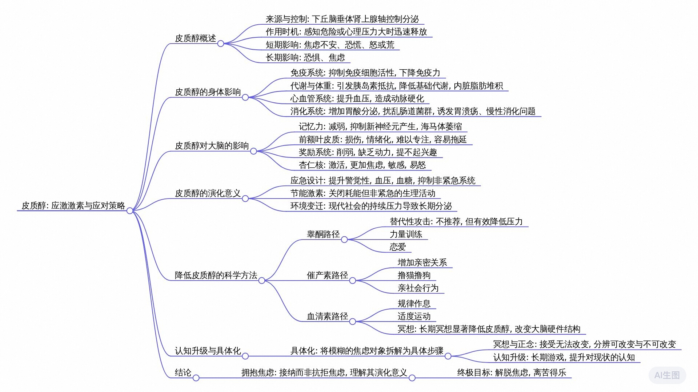

# 皮质醇：破解焦虑的底层代码

[皮质醇：破解焦虑的底层代码【矩阵之外01】_哔哩哔哩_bilibili](https://www.bilibili.com/video/BV1H3jEz1EsD)

今天我们来聊一个神奇的激素，现在开始。你最近压力大吗？有没有时常感觉莫名的焦虑、烦躁，甚至突然一下就破防了？我有一位朋友，性格温和，平时富有同情心，情绪也很稳定。哪怕工作压力再大，他也总能维持一种表面上的从容淡定。但有一个奇怪的点，只要她和外卖小哥、餐厅服务生这类服务人员起了冲突，他就像变了一个人，情绪瞬间失控，狂风暴雨，毫不留情，攻击性拉满，完全不像他。

我亲眼见过好多次，他为了一些微不足道的理由，怒怼地铁安检员，疯狂兑现淘宝客服。我之前一直很困惑，一个人怎么会有这样割裂的两面。直到我理解了一个激素，皮质醇。

一息尚存要读书。你好，我是何夕夕，欢迎来到矩阵之外第一期，这是人性矩阵系列的补充节目。人体中重要的信号分子我们已经介绍了不少，在所有还没有讲过的信号分子中，最大的遗珠毫无疑问就是今天的主角皮质醇。皮质醇由下丘脑垂体肾上腺轴控制分泌，它会在我们感觉到有危险，心理压力很大的时候迅速释放，带给我们的感觉是焦虑不安、恐慌。精确一点来说，它对三安系统的影响是短期降升升，长期降降生。因此，短期让你感觉怒或荒，处于狂躁之中。长期让你恐惧，处于焦虑之中。

如果你不知道三安系统是什么，那么推荐你看一下情绪那一期视频。而且它的影响远不是心理层面，皮质醇会全方面侵蚀你的身体，堪称万恶之源。下面我会逐条来说它的影响。但别担心，这期视频后面我会提供科学而具体的解决方案，理解是为了更好地应对。

我不想你因为听到下面这些内容就直接开始焦虑起来了。

### 皮质醇对身体的影响

首先，皮脂醇最主要的影响是抑制免疫细胞活性，让我们的免疫力下降。不过这倒未必一定是件坏事，某些疾病本来就是因为免疫系统太强大攻击身体造成的，这时候皮质醇恰好是一剂猛药。

人工合成的皮质醇一般被称为糖皮质激素，在医学上被广泛用于抑制自身免疫类疾病，比如类风湿性关节炎、过敏性哮喘、器官移植手术之后的排异反应等等。在激素类药物中，它属于副作用非常大的那种，是真正的虎狼之药。

第二，皮质醇是减肥人的大敌，它会引发胰岛素抵抗，降低基础代谢，促使内脏脂肪堆积。你听说过压力肥吗？这是一种真的存在的生理现象，我身边就有朋友因为使用糖皮质激素导致变胖。

第三，皮质醇会提升血压，造成动脉硬化，损伤心血管系统。此外，皮质醇还会增加胃酸分泌，扰乱肠道菌群，诱发胃溃疡、慢性消化等问题。光听这几条是不是就已经够糟糕的了？这还只是它直接造成的影响。

皮质醇还会压制性腺轴，降低我们的性激素分泌，从而间接造成以下影响：

*   由于压制睾酮，它会导致我们肌肉萎缩、力量下降、骨质疏松。
*   由于压制雌激素，它会导致我们皮肤胶原蛋白流失，皮肤变薄，加速老化。
*   由于压制性激素，它会导致我们生育能力降低，包括但不限于月经失调、精子质量下降等。

### 皮质醇对大脑的影响

以上这些是不是听起来已经很恐怖了，但这只是对我们身体的影响，它对我们大脑的影响才是真正的恐怖片。

长期处在高皮质醇状态，你的大脑会发生实质性的改变：

1.  记忆力减弱，皮质醇会抑制新神经元产生，削弱突触连接，抑制海马体的功能，甚至造成海马体萎缩。
2.  皮质醇会损伤你的前额叶皮质，也就是大脑中负责理性控制的区域，让人变得情绪化，难以专注，容易拖延。
3.  它会削弱奖励系统，降低多巴胺的活动，让人缺乏动力，提不起兴趣。
4.  最后，它还会激活杏仁核，也就是应激反应中枢，让你变得更加焦虑，更加敏感，更加容易爆炸。而这些又反过来刺激更多的皮质醇分泌，进入一个地狱级别的恶性循环。

稍微总结一下，对于身体来说，皮质醇是一种紊乱激素，对于生殖系统来说，皮质醇是一种下头激素，对于大脑来说，皮质醇是一种损伤激素，总的来说，是一种万恶之源激素。

## 皮质醇存在的演化逻辑

那么问题来了，为什么呢？这样的脏东西为什么还在我们的体内存在？演化压力怎么回事？怎么没有把这种东西给淘汰掉呢？达尔文救一下，达尔文。

现在你是非洲大草原上的一匹斑马，悠闲的吃着青草。这时你的各项生理指标正常。突然一只狮子一跃而出，你吓坏了。下面的几分钟如何反应，将直接决定你的生死。

于是你体内皮质醇大量释放：

*   首先它会提高你的警觉性，去甲肾上腺素上升，此时任何风吹草动都是你应当留意的信息，让你像装了雷达一样时刻警惕。
*   其次它会提升血压，确保血流能够供给大脑和肌肉。提升血糖，让储备的糖原快速转化为葡萄糖。
*   最后最重要的一点，它会抑制所有不紧急但消耗大量能量的系统，免疫系统、消化系统、生殖系统、新肌肉的合成、新记忆的生成等等，这些都是重要但耗能。而且对于应对眼前的危机毫无意义的生理活动，他们都需要立刻暂停活不过今天就没有资格谈明天。

如果类比成一个组织，皮质醇是因为公司濒临倒闭而成立的效率部，他的任务就是照着大动脉去裁员，公司马上要倒闭了，长期规划毫无意义。

从这个意义上来说，皮质醇是一种节能激素，一种应激激素。它是演化在面对危机时的聪明设计，能在关键时刻极大提升生存概率。所以真正的问题不是这个激素本身，而是环境变了。我们的大脑仍然认为我们生活在一个猛兽出没的稀树草原，但现实却是我们面对的威胁从老虎变成了老板，从狮子变成了考试，从猛兽变成了KPI房贷以及半夜突然打来的电话。老板不同于老虎的一点是它不会立刻吃掉你。考试不同于狮子的一点是它两个月后才来。现代社会中重要且不致命的威胁太多了。结果就是我们的大脑不敢关闭应急系统，于是皮质醇持续分泌一天两天，一周一个月，直到焦虑成为常态。

皮质醇系统设计的初衷是为了活过今天，放弃未来，并没有想到居然会有人一直生活在这个被放弃的未来之中。一旦皮质醇启动，要么你逃离了狮子，回到安全地带，危机解除。要么你成为狮子的午餐，危机同样解除。他根本没考虑过皮质醇连续分泌好几天甚至几个月，而你居然还活着的可能性。无论应激成功与否，斑马的皮质醇最多分泌半天。这就是那本著名的科普书《斑马为什么不会得胃溃疡》的标题含义。

## 皮质醇与社会结构

另外，演化是一个懒惰的设计师，一旦一个新的需求出现，如果旧的机制凑合着能用，那么就没有必要开发新的机制。因此，最初用于照顾幼崽的催产素，后来也被用于形成敌我之分，造成群体意识。原本是用来繁殖的性激素睾酮，后来也用于形成高下之别，造成等级意识。皮质醇的情况也类似，它跟社会结构之间也有着微妙的关联。不精确地说它是一种反向的高通，社会等级越高，睾酮越高，皮质醇越低，社会等级越低，睾酮越低，皮质醇越高。由于皮质醇与睾酮相拮抗，这点似乎不难理解，但是也有反例。

萨博斯基是一名神经科学家和动物学家，是我之前推荐过的《行为》和《斑马为什么不会得胃溃疡》的作者。这张图是萨博斯基对一个狒狒群体的研究数据，每一个点代表一只雄性狒狒的状态。横轴代表了狒狒所处的社会地位，从高到低，我们不妨把它们叫做一号狒狒、二号费费等等。纵轴代表了他们的皮质醇水平。不难看出，总体而言，社会地位越高，皮质醇越低。二号狒狒的皮质醇是最低的，但是身处塔尖的一号狒狒反而皮质醇很高，这是为什么呢？很可能是因为为了维护住地位和众多配偶，他所面临的挑战和潜在的威胁反而比所有人都大。

当然，这幅图只是一种典型状态，还有很多因素都会影响皮质醇水平的分布，比如说竞争格局。如果二号、三号狒狒都在基于首领位置，那么他们的皮质醇都会很高，比如说狒狒的性格佛系，狒狒无论身处何种环境，皮质醇都不会太高。此外还有两种重要因素，我们后面再说。总之，地位并非核心因素，最重要的还是地位带来的威胁与不安全感。归根到底，皮质醇还是那个应激激素，而我们并非生活在自己的客观处境中，而是生活在我们自己对处境的主观解读之中。

## 降低皮质醇的方法

现在我们已经大致了解了皮质醇的短期价值、长期危害和社会影响。是时候来说说真正重要的问题了，我们到底应该怎样科学有效的降低皮质醇？影响皮质醇的因素非常之多，我们可以粗略地将它们分成三大类，分别对应我们已经熟悉的三种信号分子，睾酮路径、催产素路径、血清素路径。这三种分子都可以有效压制皮质醇，都在一定程度上与皮质醇相拮抗。实际上我们身体内几乎所有的信号分子都会和皮质醇发生关联，等未来所有重要的信号分子都介绍完之后，我打算做一期总结视频，系统梳理他们之间错综复杂的关系，到时候你会发现，在这个关系网络中，皮质醇是绝对的C位。

### 睾酮路径

先来看看搞同路径，让我们再次回到狒狒部落。萨博斯基发现在狒狒部落中有这么一种现象非常常见。比如说三号狒狒被二号吠吠所攻击，体内睾酮降低，皮质醇上升，心理压力很大。但接下来只要他遇到5号狒狒，就可能突然爆发出攻击行为，毫无理由的发起进攻。结果他体内的皮质醇立刻下降，压力水平迅速回落。这个现象被叫做替代性攻击。正如鲁迅先生所说，弱者愤怒，抽刃向更弱者。这种行为可耻，但真的有用。

这种行为有用，但的确可耻。一个狒狒群体中，喜欢替代性攻击的狒狒越多，那么不同等级之间的皮质醇差异就会越大把一个猴的压力转移到另一个猴的身上，最终整个猴群的等级意识都会很强，而所有喉尤其是低等级猴所承受的压力会很大。你应该想到了视频开头我的那位朋友就是在无意中采用这样的方式来排解压力。但如果我询问他为何发火，他一定能说出一套非常自洽的理由。尽管我作为一个旁观者非常清楚，真正底层的原因根本不是外卖小哥说错了什么。真正的原因要么是上午他挨了领导的骂，要么是下午的一个考核让他惴惴不安。而我很清楚，我这个朋友也并非虚伪，而是他真的对这样的底层机制毫不知情。我们总以为我们是在用理性决策，但其实大脑皮层大部分时候的作用只是一个新闻发言人，他没有资格参与真正的高层会议，只是在决策被底层系统做出之后，给自己编出一套自圆其说的解释而已。

未来随着我们正片内容逐渐深入，你会越来越清晰的发现这个比喻的准确性。实际上，替代性攻击在人类社会中也相当普遍，而且许多比我这个朋友还恶劣的多。网络暴力是一种低成本的释放攻击性的渠道，家庭暴力是一种把家人当做五号狒狒的典型行为，还有更为恶性的暴力犯罪，其实多多少少都有替代性攻击的影子在里面。关于这些，我们不过多展开。实际上与上述图相比，对抗性强的网络游戏已经算是一种非常健康无害的发泄途径了当我把这个研究跟我那位朋友分享之后，他类似的行为并没有完全消失，但确实温和了不少，每次再遇到类似情况，我都会调侃，怎么又找到五号狒狒了。

替代性攻击绝对算不上什么好办法，但搞通路径不仅仅只有替代攻击，还包括力量训练、谈恋爱等等。关于如何增加睾酮，你可以看《人性矩阵·03 睾酮：与人间一切的斗争》。另外，健身区博主有更丰富的方法分享，但镐童相关的方法多多少少操作起来有一点点困难。

### 催产素路径

那有没有更轻松的办法来压制皮唇呢？有的，我们来看看第二种方法，催产素路径。催产素能有效压制皮质醇，这有着非常明确的研究证据，所有能提高催产素的方法都可以降低皮质醇，在生理层面显著降低压力反应，而且毫无疑问，这一定就是催产素与长期幸福感高度相关的重要原因之一，那么具体该怎么做呢？关于催产素的详细机制，你可以参考正片《性矩阵·02 催产：赋予人间一切的美好》简单来说，所有与增加亲密关系有关的行为，与萌萌的东西有关的行为，与获得社会支持有关的行为，都会增加催产素，我们这里简单举几个例子。

与朋友吐槽领导，不仅仅是获得认知上的共鸣，是真的会有生理性的压力降低，与朋友或者伴侣多多拥抱，哪怕只是口头上的云抱抱，也会真实的增加幸福感，降低压力。当然，如果你此刻并没有稳定良好的亲密关系，那么一只猫猫真的是维持身心健康最低成本的选择，如果你确实没有条件，那么多逛逛萌宠区云吸猫也会有帮助。这些方法真的有效。当你感慨自己被生活中的美好治愈了，这绝不是一个比喻，他们或许比很多药物都有用。关于狒狒群体的研究也发现，社交互助行为更多、互相理毛次数更多的狒狒，皮质醇水平明显更低。

### 血清素路径

除了前面所说的睾酮路径、催产素路径，还有血清素路径，睾酮是我能赢，催产素是我被爱，血清素是我很好，血青素可以抑制皮质醇，这也有非常明确的实证研究证据。因此，所有能提高血清素的方法基本上也都能够有效抑制皮质醇，包括规律作息、适度运动、冥想等。

其中冥想的研究尤为显著。2007年的一项研究发现，长期冥想超过1万小时的人主要是一些西藏喇嘛，皮质醇基础水平显著低于普通人和冥想初学者。而面对负面的刺激，他们的信任核反应更弱，前额叶启动速度更快，主观报告的焦虑与压力感也更低。

长期冥想不只是改变我们的心态，是实实在在的在改变我们大脑的硬件结构。佛教修行者将打坐当做修行主要方法之一，确实有生理依据。近年来这类研究越来越多，结果非常一致，冥想对身心健康的好处已经无可争议。我本人也已经坚持冥想将近四年，主观感受是确实非常有用，我能明显感觉到我整个人的状态和看待世界的方式与四年前发生了本质性变化。

## 焦虑的根源与认知升级

看到这里，也许一些理性的朋友就要说了，这些方法听起来确实不错，可终究只是让你自己感觉好一点，治标不治本。我的考试就在那里，我的KPI就在那里，我喜怒无常的老板就在那里，解决不了不安的来源，这些似乎都只是缓解，真的吗？如果你这么想的话，我们就来看看焦虑的根源到底是什么？焦虑的根源真的是那只狮子吗？不是的，焦虑的根源是你对它的认知方式。这不是在玩弄文字游戏，而是有实证研究中的心理学共识。

但我们不妨先来进行一个离谱的思想实验。让我们回到大草原上，现在你是一匹斑马，安静的吃着草。

你不知道一公里外正有一只饥饿的狮子在徘徊觅食。因为你对此一无所知，所以你无忧无虑，不会得胃溃疡。你确实不会过度分泌胃酸，但代价是你有不小的概率会进入狮子的胃酸。

我们现在来升级一下，你现在拥有了人类的大脑和一个高科技狮子探测器，它会在狮子靠近你2公里范围内时自动亮灯报警。现在灯亮了，你知道你附近有一只狮子，但你不知道具体在哪儿，也不知道自己该往哪个方向跑。这时你陷入了人类常见的焦虑状态，皮质醇爆表。

我们再升级一下，把这个简陋的探测器换成北斗导航系统，让你实时看到狮子的准确定位，狮子同样还在一公里外，但这次你能清楚的判断出安全的逃跑路线，此时你的焦虑感就大大降低了。更进一步，如果你还能实时看到狮子的直播影像，甚至能判断出狮子有没有发现你，那么你可能不仅不焦虑，甚至会获得一种逛野生动物园的快感。

狮子还是那个狮子，改变的只有你的认知，随着认知的提升，你的焦虑感会先猛然上升，然后逐渐下降。这与著名的达克曲线相符。不会胃溃疡的斑马处在愚昧之风，深陷焦虑的现代人在绝望之谷。而如果你持续学习，提升对现状的认知，构建你自己的北斗导航系统，我想告诉你，那个开悟之坡是真的存在的。

我们不妨举一个更现实的例子。你是一个刚毕业的大学生，笙懵懵懂懂种种机缘进入体制内，成为了一位大领导的秘书。由于你不懂人情世故，领导的许多暗示和敲打，你压根没感觉到你处在愚昧之风，不焦虑，但其实很危险。随着几次现实的毒打，你开始意识到一些问题，但是又没有透彻的理解，这时候你的状态是最差的，你丧失了无知带来的盲目自信，开始过度解读，进退失据。领导的每一个眼神，都让你的内心上演一出小公务员之死。

伴君如伴虎是一种比喻，但也不是一种比喻。你体内为老虎准备的应急开关关不上，血清素极低，皮质醇极高，长期处于这个状态，你的身心都会受到腐蚀。终于有一天，你发现了一本奇书，叫《参谋助手论：为首长服务的艺术》。这是一本二十多年体制内老秘书所写，书中全是干货与经验，堪称做秘书的圣经，你对照书中的知识，加上自己的实践总结、体会、揣摩，一点点建立起自己的认知框架，终于你获得了自己的北斗导航系统。领导还是那个领导，脾气还是那个脾气，问题还是那些问题。世界并没有改变，但你现在感觉不到一丝焦虑，只有游刃有余的从容。以前伴君如伴虎，现在伴君如斗猫。

## 如何迈出第一步？

看到这儿，一些深度焦虑的朋友可能要说了，你说的都很好，我也知道提升认知的终点会很好，但我现在压根就无法迈出第一步，考试的焦虑让我压根就无法翻开书。KPI的压力让我只想点开短视频，那个美好的终点我是相信的，但我真的没有办法开始，我已经被锁死在了那个恐怖的循环之中。关于这种状态我其实很熟悉，因为我也曾经深陷其中，所以最后的这些话可能对你会有一点点帮助。

让我们再次回到我们的矩阵。既然皮质醇这么重要，为什么没有放进这个矩阵当中呢？首先是因为它的作用非常特殊，更像一个系统管理员，而非系统本身。如果要把皮脂醇放进去，还要体现出它与其他信号分子之间的相互作用，可能需要完全重构现在表格的拓扑结构。其次，出于简洁性的考虑，必须有所取舍。以粟裕将军的功劳，没有平常元帅确实可惜，但总要有一个第一大将，这也是没有办法的事情。

我们小结一下几种降低皮质醇的途径：

*   **睾酮途径**，其中包括替代性攻击。这个确实有用，但我绝不推荐，我劝你尽量不要使用。另外，力量训练与恋爱具备条件的朋友可以尝试。
*   **催产素途径**，包括加强亲密关系、撸猫撸狗、亲社会行为。强烈推荐，人间美好真的可以将你治愈。
*   **血清素途径**，除了适度运动、规律作息以外，冥想正念可以改变大脑硬件，减少几乎所有心理问题。

此外改变认知是真正的解决问题之道，但有时候你根本无法开始。究竟该如何迈出第一步呢？我必须要给你介绍目前主流的认知行为疗法CBT中最核心的逻辑——具体化。所谓具体化就是把你内心那个模糊恐怖的焦虑对象具体明确的拆解出来。恐惧的对象在你的内心是一团面目模糊的黑雾，是无法描述、不可名状、难以直视的克苏鲁看一眼你就散之狂掉，只想逃避。

但其实克苏鲁真的存在吗？如果你盯着他的一只触手，看看清他的每一个吸盘，看着看着你就会发现它只是一卷犹豫须KPI真的存在吗？真实存在的只是几通要打的电话求职活动真的存在吗？真实存在的只是一封封要发的邮件。考试真的存在吗？真实存在的只有一行行要写的字，每一个具体的动作和步骤都没有那么难，没有那么难以直视。如果还是难以面对，那不妨拆解的更细致一些。发送邮件也不存在，只是一次次键盘的敲击和鼠标的点击。

恐惧来自模糊与未知，行动来自结构和具体。佛说KPI即非KPI市民KPI佛说克苏鲁季菲，克苏鲁是明克苏鲁，诸相非相能断金刚。具体化是一个起点，给你勇气，改变你能改变的冥想。正念是一场修行，给你从容接受，你无法改变。而认知升级是一个漫长的游戏，给你智慧分辨以上两者之间的界限。

以上是我能为你总结的关于焦虑的最完整解决方案，如果你感觉有所启发，欢迎一键三连。或许能帮助到更多被困住的人，也或许能帮助减少人间的五号费费。如果现在的你还是无法避免的处于焦虑之中，那么就不要避免它了。最糟糕的从来都不是焦虑本身，而是对自己仍然焦虑这件事的焦虑，越抗拒什么什么就越加强，越接纳什么什么就越流走。不妨暂时拥抱自己的焦虑吧。这是古老的基因设置的救命激素，是演化规律的得意之作。他牺牲了未来的一切，只为了你能在此刻活下去。某种意义上说，这是一种致命的温柔，依稀尚存。窑读书，我是何夕夕，祝你早日解脱，离苦得乐。

