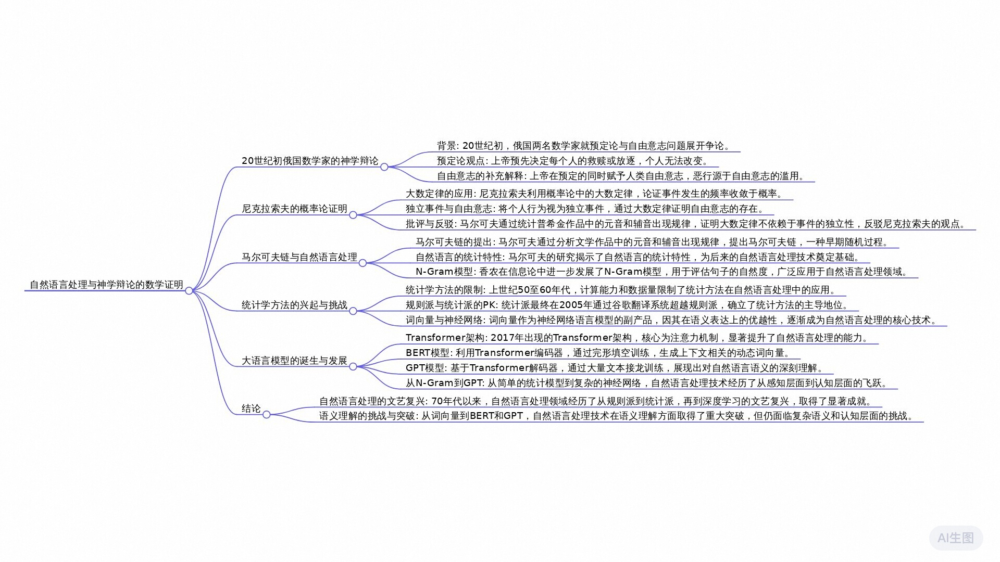

# 自然语言处理的“古往”和“今来” 

[【计算机博物志】自然语言处理的“古往”和“今来”_哔哩哔哩_bilibili](https://www.bilibili.com/video/BV1yi4y1B7Jt/)

# 预定论与自由意志的百年争论

在20世纪初的俄国，有两名数学家就神学领域的预定论和自由意志问题发生了一次并不为太多人所知的争论。预定论认为，上帝已经预先决定了每个人的救赎或放逐，个人无法改变这一点。很显然，这很容易让人们得出这样的结论，人无需为自己的行为负责，即便是杀人放火这样的恶行，因为在因果既定的情况下，即便是恶，那也是上帝的责任。于是后来出现了一种补充解释，他们说，上帝在遇定的同时，也将自由意志这一高贵的特性赋予了人类，而恶行正是来自于人对自由的滥用，和上帝无关。自然有很多人对这种类似补丁的解释并不认可。实际上，人们在这个问题上的辩论乃至争吵绵延了近好几个世纪。

## 内克拉索夫的数学证明

20世纪初，俄国的一名有神学背景的数学家帕韦尔·内克拉索夫颇有牛顿爵士的遗风。他在1902年的时候想到了一种用数学方法来证明神学问题的路子，并发表了文章。这个路子正是概率论中十分古老却十分重要的大数定律。简单来说就是事件发生的频率将收敛于它的概率。比如抛掷一枚质地均匀的理想硬币，如果只抛几次，那正面和反面出现的结果可能具有相当的随机性。比如五次中出现四次正面一次反面这样极端的情况。但当我们把这个实验反复的进行下去，正反两面出现的频率必然越来越像1/2和1/2这个理论上的概率值靠拢，而且实验的次数越多就越为递进。

但自伯努利时代开始，大数定理的成立都有一个前提条件，那就是事件的独立性。比如在抛掷一枚硬币的时候，每一次的结果都和之前和之后的抛掷无关。所以尼克拉索夫的路子就是把互不相干的独立事件看作是自由意志的体现。每个人的行为选择都是自由的，互不相干真的不成因果的。而从当时社会上收集的关于个人行为的数据资料来看，比如犯罪记录的统计结果都符合大数定理。所以根据大数定理的成立，前提是事件的独立性，便得到了个人的行为是独立和自愿的这个结论。

## 马尔可夫的反驳

尼克拉索夫在给一个数学理论精心打扮一番之后，便自认为由此证明了自由意志的存在，人类的恶行和上帝无关啊。但和今天许多把数学和科学引入神学和玄学的人，往往都会受到各种尖锐的抨击一样，这个观点很快就遭到了俄国另外一名数学家激烈的批评。不幸的是，这名批评者正是俄国大名鼎鼎的数学家马尔可夫。马尔可夫的反驳方式很高明，他甚至根本没有理会将自由意志比作独立事件这件事情本身的合理性，而是选择了直接攻击其中的数学基础，证明大数定理的成立并不需要事件的独立性假设。而马尔可夫的做法也很直接，那就是找到一种不符合独立性假设的事件，然后在其中找到大数定理的存在。于是，马尔可夫找来了一本俄国著名文学家普希金的诗歌小说《尤金·奥涅金》，然后手工统计了前2万个字母中元音和辅音的规律，他发现元音和辅音出现的频率最终也收敛到了一个固定值，出现了大数定律。

但元音和辅音的出现是独立事件吗？从我们对人类语言特点的感性直觉来看，大体不是。只要随便打开一篇英文文章，找到一些元音字母，就会发现紧接着后面还是一个元音的情况十分稀少，而接着一个辅音的情况就很多了。

也就是说直观上来看，一个元音字母的出现，会让下一个字母也是元音的概率降低一，而并非像抛硬币那样，每一次都是前后无关的独立事件。当然，马尔可夫用更为严谨的数学方法对此进行了论述。按照统计结果，根据大数定理，这本书中的元音和辅音出现的概率是大约是0.28和0.72。

### 独立性假设的证伪

首先，我们不妨假设元音和辅音的出现都是独立事件。那么根据独立事件的乘法定理，连续出现两次原因的概率应该是0.28乘以0.28。所以这本有二十多万个字母的书中，应该出现大约16500对两个连续的原因。最后再去统计一下这本书中的真实情况，发现两个连续的原因只出现了7388对，这和基于独立性假设的理论值之间的差距超过了2倍，因此认为元音和辅音的出现是独立事件的假设并不成立。但同时他们的统计结果却确实显现了大数定律。最终，马尔可夫于1913年在圣彼得堡帝国科学院的演讲中总结了他的发现，如此也就完成了对内克拉索夫关于自由意志言论的会心一击。而如果我们把元音和辅音各自看作一个状态，而将两个连续字四种情况看作是两个状态之间的4种转移方式，每种转移都按照一个特定的概率发生。这便是大家所熟悉的马尔可夫链，一种非常早期但十分重要的随机过程。

## 马尔可夫链与自然语言研究

用数学方法研究文学作品，以现在的眼光来看，这在当时是一个新颖度爆表的想法。马尔可夫在主观上为何如此高瞻远瞩，我们不得而知。但客观上来说，在那个不知计算机为何物，无论互联网的时代，有大量字母组成的文学作品，大约是马尔可夫为数不多的选择吧。如此，也就不难想象这项研究在当时很难有什么后续的发展，因为用笔和纸做统计的工作太过枯燥乏味了，数学家们普遍更乐于研究能够在智力上产生愉悦的工作。即便是马尔可夫本人，也很难说支撑他完成这项枯燥工作的动机，到底是这个问题本身多一点，还是在那场争论中的好胜心多一点。毕竟从他的生平记录来看，他是一个十分好斗的人。所以，虽然马尔可夫阴差阳错地向人们揭示了通过统计学方法进行自然语言研究的可能，但之后便如泥牛入大海，杳然无音讯。

### 香农的回响与N-gram模型

直到35年以后，另一位大师人物香农在信息论的开山之作《通信的数学原理》中，还对马尔可夫的研究做出了回响。香农研究的是通信问题，所以他用自然语言作为例子并不意外。他在这篇论文中介绍离散信源的部分，详细的描述了自然语言中存在的马尔可夫随机过程，甚至出现了对今天仍然十分活跃的N-gram模型的描述。

所谓N-gram就是N连字。前面马尔可夫的工作，实际上是一种只涉及元音和辅音的二连字，也就是看看元音后连着元音或辅音以及辅音后连着元音或辅音的概率。而更一般的二连字则是统计所有字母间的连字情况。比如在英文的26个字母中，统计A后面连着A的概率，连着B的概率，连着C的概率。如此这般以及B后面连着A的概率，连着B的概率，连着C的概率等等等等。更进一步，我们还能继续研究更为复杂的连字情况，比如三连字，而更一般的情况则是N个字母的连接情况，也就是N连字。

而利用N-gram模型就能评估出一个句子像人话的程度。比如下面两句话，如果我们用二连字模型就会发现第一个句子中两个连字有很多是常见的词，因此在统计语料中的统计频率或者说出现的概率较高。而第二句话中就很低了。如果我们把句子中的所有2词的概率值乘起来，算出整个句子出现的可能性，那么第一句话像人话的概率就远远大于第二句。

N-gram语言模型在自然语言处理领域的应用十分广泛。比如搜索引擎可以利用N-gram模型帮用户联想出最有可能的后续输入。再比如输入法可以利用N-gram评估出一个拼音最有可能对应的汉字等等等等。而且直到进入21世纪以后，在那些基于神经网络的先进技术开始流行以前，N-gram一直都是自然语言处理中常用的语言模型。当然，和马尔可夫一样，香农的这项工作本意也并非是自然语言处理，用自然语言也只是为了说明信息理论而已，但不论怎么讲，在两个如此重要并影响至今的工作中都如此强烈的表明了自然语言的统计特性之后，尤其是考虑到香农那篇论文的影响力。

## 统计学方法在自然语言处理中的应用

从今天的眼光来看，大方向已然明朗的情况下，自然语言处理技术不得起飞了。但遗憾的是在随后的20世纪50至60年代这整整20年里，人们都并无太多的进展。除了计算能力和数据量对统计方法的客观限制，这其中多少也存在着由思维惯性导致的主观障碍。人类的科技发展很多时候都会受此羁绊。即便是今天，我们在网上仍然偶尔还能看到一些关于概率论和统计学是否是严格数学的讨论。当然，如今仍持有这种怀疑态度的人，多半是对概率论和数理统计不太了解而产生的主观臆断。但在马尔可夫甚至香农的那个时代，这确确实是一个值得思考的问题。因为直到1933年，概率论的公理化工作才被俄国数学家柯尔莫哥洛夫完成。

而至于数理统计学，一种常见的观点是，费希尔在1922年发表了关于统计学数学基础的论文，标志着这门学科的诞生。并且直到1946年在瑞士科学家克莱姆发表了《统计的数学方法》之后，才意味着这门学科的成熟。所以当时很多人都认为，用粗鄙的统计方法去研究自然语言这样复杂且精密的任务，多少显得有点轻浮。这其中反应最为激烈的要属语言学家，因为在人类过往的历史中，自然语言的研究向来是他们的专业。而且自文艺复兴末期开始到20世纪，早在这近300年的时间里，西方的语言学家也确实对世界上许多语言进行了相当系统化的总结，形成了一套非常完备的系统，颇有一些祖宗之法不可变的意思。

### 语法规则的局限性

语言学家的主要方法是对语法和词性层面的分析，比如“猫追老鼠”这句话，从词性的角度来看，猫是名词，追是动词，老鼠是名词。从语法的角度来看，猫是主语，追是谓语，而老鼠是宾语。由此，我们便得到了一棵句法分析树。好，你已经知晓了句法分析的核心技术，现在请你画出“吃葡萄不吐葡萄皮，不吃葡萄吐葡萄皮”这句话的分析树。

确实，就像你无论分析过多少句子的句法规则，都始终会遇到语言中更为复杂甚至离奇的句子一样，试图去总结人类语言中的全部语法规则是一个浩大而繁杂的工程。如果还要考虑到不同语言之间语法规则的差异，这几乎就是一个不可能的任务。当然，信心满满的语言学家和赞同语言学家看法的研究者们，在上个世纪50年代和60年代充分发挥了愚公移山的精神。他们认为，只要坚持不懈的去补全其中的规则，自然语言的大厦终有一天会被建成。但这些动则主谓宾状补的语言学家们却忘了，语言的本质是语义，而并非符号规则本身。比如我们在这句话后面再加上一段，这里的“交代”在语义上实际上是“被捉”或“被杀”，单靠规则去区分这种上下文相关的语义信息是十分困难的。

不仅是上下文，自然语言中往往还会涉及一些体现人类心智的世界知识，比如我们在这段话后面再加一段人类利用自己的世界知识，很自然的就能理解这两个“吃饭”所表达的不同含义，但基于规则的方法又该如何体会这其中的玄妙呢？实际上，一个语言中的字词符号虽然是一个有穷的集合，但他们所组成的句子文本却有无穷的情况。比如网络上流行的各种不太符合语法规则但很少有人看不懂的语言现象。这些语言学家大约在用有限的精力投入到无限的事业中，属于是在经历了碌碌无为的20年后。

## 统计学方法的复兴

从上个世纪70年代开始，人们对自然语言的研究兜兜转转之间又回到了统计学的道路。这种转变的发生同样还是由于客观和主观两个方面的变化。这时候，基于超大规模集成电路的第四代电子计算机已经出现，互联网也已诞生。由此，统计学方法在算力和数据上的客观障碍开始被逐渐克服。而在60年代末，经过20年的挣扎之后，人们终于开始对基于规则的方法的有效性产生了普遍的怀疑和相当的失望。直到后来著名的人工智能科学家明斯基也开始宣扬这种观点的时候，相关部门便最终决定缩减对这方面研究的资助。这是人们思维上的主观改变。于是自然语言处理领域从70年代开始了一场文艺复兴，人们又想起了香农在二十多年前提出的N-gram，以及半个多世纪前马尔可夫在一部文学作品中所讨论的随机过程。

而随着加入统计派的研究者越来越多，研究的也越来越深入，基于统计学方法的自然语言处理技术在这期间确实取得了相当不俗的成绩。比如在马尔可夫链的基础上，人们提出了隐马尔可夫模型，并将其应用于语音识别这个自然语言处理的子领域。我们曾在往期视频中讨论过这个问题，用隐马尔可夫模型作为声学模型识别出声波中的音素，然后用N-gram作为语言模型找到这段因素最有可能的句子。最终人们将语音识别这个一直被认为几乎无法实现的技术做到了极高的可用性。总体来看，上个世纪70年代到本世纪初，基于统计学的自然语言处理确实取得了相当耀眼的成就，尤其是考虑到在上一个20年里人们在语言学家所编制的泥淖中乏善可陈的表现。后来，统计派的代表人物贾里尼克用一句十分俏皮的话回望了这段蹉跎的岁月。

### 传统统计学方法的局限

但不论如何，如果你仔细去观察这一阶段的成果就会发现，他们也只限于感知层面，而未能在认知层面上取得进展。比如将一段声音识别为文字，并利用用户输入的开头进行简单的联想词补全等等。这些并不涉及对语言深入理解的场景，但一旦涉及到像问答系统这样复杂的情况，传统的统计学方法便也是心有余而力不足矣。如果说基于规则的方法是根本做不到，那么传统的统计学方法则是完全做不好。简单的统计学方法难以应对语言中由变化万千的语义所带来的复杂。所以语义语义，我们究竟该如何才能将你驯服呢？或许我们需要一个更为复杂的系统。

## 神经网络与词向量

和自然语言处理一样，神经网络技术从上个世纪40年代开始，一路走来也是相当的坎坷，一直到21世纪以后才开始渐入佳境。神经网络作为一种典型的人工智能技术，一旦机会成熟，自然也不会放过对这个被誉为人工智能皇冠上的明珠的问题发起挑战的机会。

我们知道，一个神经网络本质上可以看作是一个强大而灵活的函数拟合机，只要确定好我们的预测目标，然后把数据送入，通过反复的训练就能让它拟合出符合我们预期的任意函数。如此，很难让人不产生这样的思路，把文本中连续的几个词作为神经网络的输入，而把输出作为对下一个词的概率预测。也就是说，用神经网络实现一个N-gram语言模型，而通过大量的训练模型，在看过训练语料中各种各样的句子之后，这个预测结果便越来越接近语言中的真实情况。也就是说，相比于传统的N-gram神经网络通过拟合一个概率函数代替了通过统计频率对概率值的估算过程。这就是2003年由如今深度学习的领军人物本吉奥发表的一种基于神经概率的语言模型论文中大体的思路。但如果仅仅是用神经网络的方法完成一个和N-gram一样的语言模型，那似乎也并没有什么特别的地方。然而在这其中出现了一个副产物，却对此后的自然语言处理研究产生了重大的启发并影响至今。

### 词向量的生成与特性

我们都知道神经网络的输入是向量数据。所以这些基于神经网络的方法要解决的第一个问题就是如何把词转化成向量表示。也就是词向量，很自然的做法是这样的，给每个词分配一个固定维度的向量，比如300维，并随机初始化这些向量的值。于是对于这个句子，输入神经网络就是这三个词的词向量。而输出则是关于词汇表中所有词的一个概率分布，概率值最高的作为下一个词的预测结果。模型在充足的语料数据经过充分的训练之后，第5237个对应的“老鼠”这个词的概率在这个输入下最终将成为最大的值。

一个极为美妙的事情是这些词向量在训练的过程中也会被更新。如此我们来想象这样的一种情况，由于“老鼠”和“耗子”这两个词在语义上几乎相同，这两个词往往会出现在很多相同或相近的语境中。比如“猫是老鼠的天敌”和“猫是耗子的天敌”。如此当神经网络输入“猫是老鼠的”和“猫是耗子的”这两个文本序列的时候，最终训练的结果应该是得到相同或相似的预测输出，也就是让“天敌”这个词的概率值最大。而这两个文本中除了“老鼠”和“耗子”这两个词，其他词完全相同，也就是说这两个词往往出现在相同或相似的上下文中，所以要保证输出值的相同或相似，唯一的可能就是在训练的过程中让这两个词的词向量变得相同或相似。

也就是说，随着训练的进行，这两个词的词向量在向量空间中会变得越来越近。与此相反，对于“大树”这个词，由于在语料中很少会和“老鼠”有相似的上下文，因此训练的结果是他们的词向量会距离较远。更进一步，那些语义上更为疏远的词，最终在向量空间中的距离也更为遥远。

词向量的这种特性十分的美妙，我们在往期视频中曾反复的论述过这个问题。除了把词在语义上的亲和疏映射到空间的聚和散以外，它甚至具备了一定的推理能力。比如“猫”这个词的向量减去“老鼠”这个词的向量的结果向量，就和“警察”减去“小偷”的结果向量十分的相似。于是我们便发现了“警察”和“小偷”以及“猫”和“老鼠”在语义上的相对关系，这有利于发现语言中较为深层次的语义信息。

### Word2Vec的兴起

词向量本是人们用神经网络实现像N-gram这样语言模型的一个副产品，但由于其在语义表达上精妙绝伦的特点，这个概念逐渐成为了自然语言处理中最基本的手法。当然，这个过程需要一段时间。本世纪初，神经网络的研究并不像今天那样混得风生水起，用神经网络做自然语言处理在当时也并非主流的研究方向。当时规则派和统计派这两个主流流派的PK还未彻底结束，直到2005年，随着基于统计方法的谷歌翻译系统全面超过基于规则的SYSTRAN翻译系统，统计派才最终完成对规则派的绝杀。所以这项技术出现后，在自然语言处理里也未能掀起太大的水花。但大约从2010年开始，随着深度学习带来的本轮人工智能热潮，神经网络的主流性开始得以显现，词向量的美妙特性也随之开始被人们重新发掘。

2013年，谷歌团队在本吉奥10年前的工作基础上提出的Word2Vec的词向量技术。从名字上就可以看出来，它的关注点已经不再是语言模型本身，得到词向量这个副产物成为了主要的目的。当然，词向量的产生仍然来自于对语言模型的训练过程，Word2Vec的整体思路和它的前序工作类似，但考虑到计算的性能，对神经网络的结构做了一定的精简，并且设计了两种新的语言模型，Skip-gram和CBOW。N-gram模型是用前N减一个词来预测第N个词，Skip-gram则是给定一个中心词，围绕中心词划定上下文窗口，然后用中心词来预测上下文窗口内的其他词出现的概率。CBOW模型的方法则正好相反，它把中心词挖掉，然后用其他词来预测这个中心词概率。关于这两个模型的设计动机和优劣，在这里不做过多的论述，但本质上和前面N-gram模式的神经网络方法一致，即在大量语料中通过对上下文相关问题的训练来发掘词向量在语义上的表达。

在2013年这个时间点，算力和数据早已不再是障碍，深度学习本身也在人工智能领域乃至整个科技界显露锋芒。于是，和十年前的寂寂无名不同，Word2Vec很快便将词向量技术推向了自然语言处理的舞台中央。以至于在2023年，在这个大模型繁花似锦的时间点，ACL将时间检验奖颁给了Word2Vec。所以它和大语言模型又有何种渊源？

## Transformer与大语言模型

大语言模型的起点是2017年出现的Transformer网络架构，而Transformer中的核心机制则是注意力。所谓注意力机制就是字面上的意思。比如有这么一段文本，剧中“包袱”的含义很明显依赖前面的“相声”，但它们距离很远，而“食物”和“打包”这样的词却距离它很近，这在过去的各种方法中都很容易导致将“包袱”理解为用来包东西的布，而注意力机制的做法则是在一个句子序列中的各个词上分配不同的注意力值来处理语言中的依赖问题。这和人类的处理方式很接近。比如我们在分析“包袱”的具体含义时，人类对语义高超的洞察力会让我们格外注意“相声”这个词，并忽略其他无关的词，最后得到其正确的含义。

Transformer架构的本意是用来做翻译任务，分为编码器和解码器两个部分。编码器是一个以注意力机制为主的多层神经网络，通过注意力机制对输入数据的上下文进行观察，最终将输入文本编码为一个数据送入解码器。解码器也是一个以注意力机制为主的多层神经网络，通过注意力机制对编码器的输入和已解码的文本进行观察，输出翻译结果。比如先观察原句子的编码结果，输出“我”，然后再观察编码结果和已解码的“我”，输出“有”。再观察编码结果和已解码的“我有”，输出“一”，如此这般，直到翻译完成。由于注意力机制在上下文处理中十分有效，同时Transformer的结构本身也十分的精妙，因此成为了当时最为先进的翻译模型。

### BERT与动态词向量

然而很快人们就发现了Transformer架构中所蕴含的无限可能。其实自Word2Vec以后，深度学习领域的研究者们就开始不断的探索如何进一步加强词向量对语义的表达能力这个问题，并尝试过用不同的网络结构来做训练。比如在Transformer出现的同一时期，就有人同时把Word2Vec中简单的神经网络替换为适用于序列问题的循环神经网络，并取得了不错的效果。但受限于循环神经网络本身在训练难度和长依赖上的疲软，提升的程度始终有限，而那些选择了较为新颖的Transformer的则取得了更大的成就。

为了搞清楚这其中的玄机，我们需要稍微再了解一点点Transformer中的工作细节。对于编码器来说，它对输入文本的编码过程是这样的。对于第一个词，编码器将通过注意力机制为其算出一个向量值，显然这其中包含了它所在上下文的丰富信息。同样，对于第二个词，编码器通过注意力机制也为其算出一个向量值。如此这般，每一个词经过编码器之后，都会得到一个和它所在上下文紧密相关的向量。如果把这个向量作为该词的词向量，考虑到注意力机制对上下文的洞察力，那不得起飞了。于是第二年谷歌就按照这个路子，在Transformer的编码器上实现了闻名遐迩的BERT模型。

BERT的训练过程和Word2Vec技术中的CBOW模型几乎一模一样，把输入文本中的某些词遮住，让编码器网络预测被遮盖的部分是什么词。一开始自然是驴唇不对马嘴，但利用正确答案和预测之间的差异去更新网络参数。在经过海量的数据、大量的训练之后，模型的预测便越来越准确，人们将这种训练模式也称之为完形填空。在经过如此这般大规模的训练之后，就像CBOW一样，词向量逐渐开始显现语义表达的能力。

除了注意力机制在上下文处理上的强大和Transformer结构本身的精妙以外，BERT以及其他类似模型在词向量的生成方式上也更近了一步。比如有这样两句话，显然第一个“墨水”指的是一种用来显色的液体，是一个具体的事物。而第二个“墨水”指的是文化知识，是一个抽象的概念。对于Word2Vec这样传统的词向量技术，最后的训练结果可能是这样的：墨水这个词属于一些其他液体名词和一些关乎文化知识的词的中间地带。而且在训练结束之后，它的位置就在这里不动了。

虽然对一种液体和文化知识都有所指向和表达，但也正是这种两头兼顾的情况让他变得有些含糊。比如在第一个句子中讲道理，此时“墨水”明确的表达了一种液体的语义，所以此时对文化知识的语义偏向是无用的，甚至是有害的，因为这样它偏离了本该明确的语义。而BERT则可以看作是一种能够应对这个问题的动态词向量。如何将第一句话送入BERT？模型将使用注意力机制，通过对整个输入文本的观察，对“墨水”一词输出一个包含其上下文信息的词向量。也就是说，它在读入这个句子之后，便结合上下文信息，让这里的“墨水”直接进入一种液体的区域，绝不含糊。同样，如果读入的是第二个句子，得到的向量值便直接进入了文化知识的区域，也就是说，BERT提供了一种关乎上下文的动态词向量表达，这和我们人类理解词汇的方式更为相像了。

### GPT模型与上下文预测

另一方面，另一波人对Transformer解码器的探索也取得了巨大的成就。以事后诸葛亮的眼光来看，可以说是更大的成就。我们说原始的Transformer解码器通过同时观察编码器的输出和已经解码输出来预测下一个输出的词。一个单独的解码器现在则只通过观察已经解码的输出来预测下一个词。比如从第一个词开始预测出下一个词，然后把已经输出的这两个词输入，预测出第三个词，再把已经输出的三个词输入预测第四个词，如此这般。而主要的训练方法就是用大量的训练语料去不断的进行这种词语接龙的过程。

一开始接龙的结果自然是胡言乱语，所以会通过计算真实句子和预测之间的误差来更新模型。在经过大量数据的充分训练之后，模型的输出便越来越像人话，和BERT一样。如此，这个解码器模型也开始显现出对自然语言中语义的理解能力，这便是GPT模型的原理。

一个极为精妙的事情是，如果我们给模型指定一些开始的文本，那么接龙的后续便就是关于这些既有文本的扩展，而这些扩展呈现出了模型令人惊讶的语义理解力。比如，如果输入的文本是一个问题，那么后续的输出就是这些问题的答案。而作为解码器，初始文本的用户输入也被称之为提示词。到此你也许会发现，虽然GPT在具体实现上的复杂度和古老的N-gram模型已经不可同日而语，但两者整体上的工作模式却几乎相同。根据前面的词去预测后续的词，正可谓“往事越百年N-gram，今又是换了人间”。

